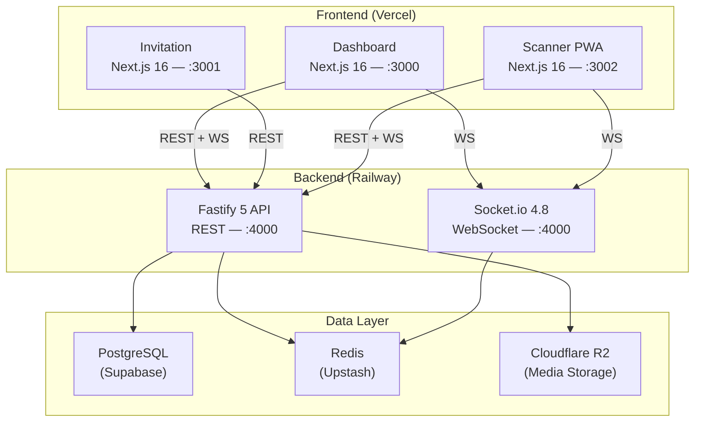
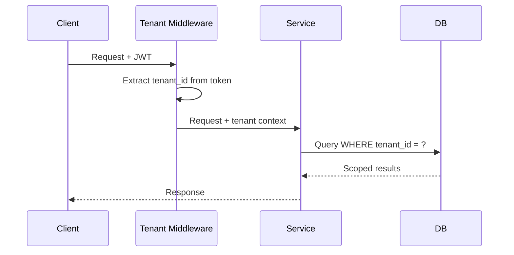
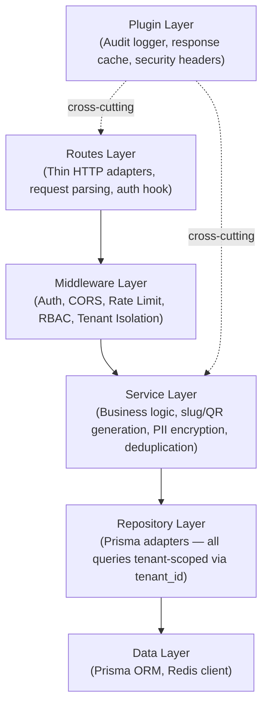
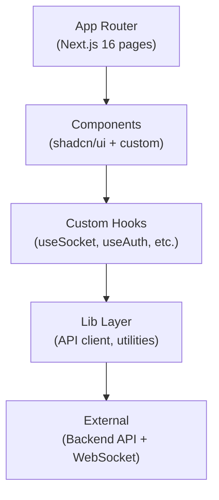
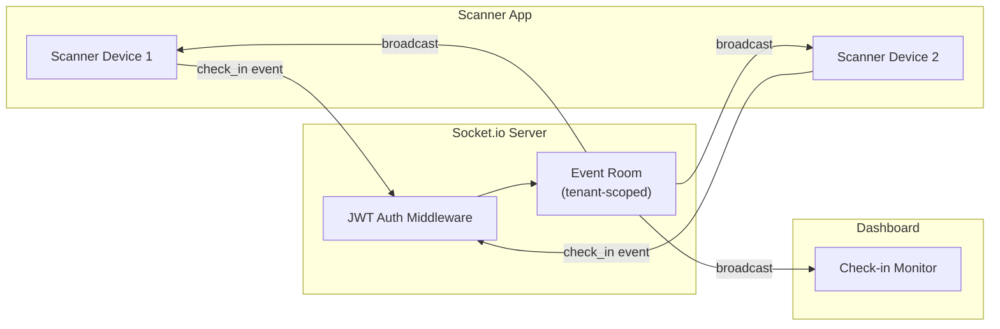
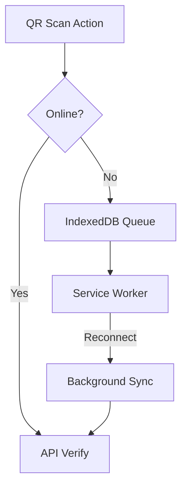
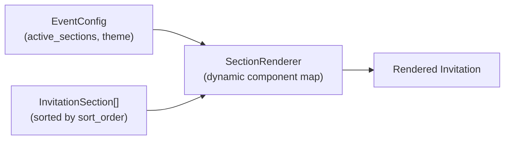
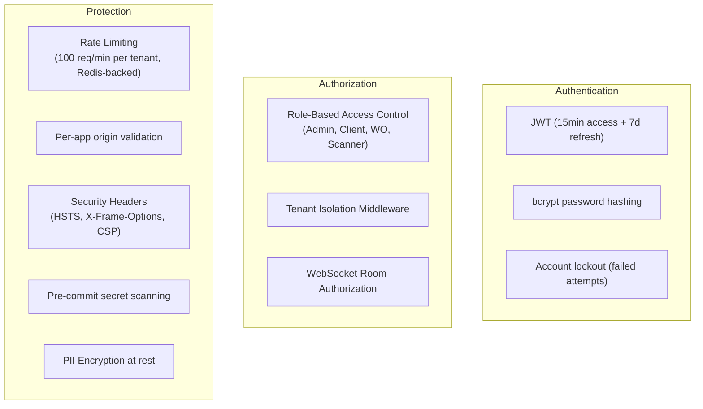
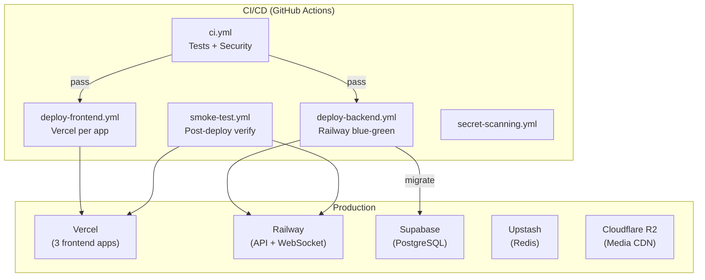

# Architecture

## System Overview

## Architectural Patterns

### Multi-Tenant Isolation

Every database table includes `tenant_id`. All queries are scoped at the service layer via middleware.

### Layered Backend Architecture

**Domain coverage**: Guest and CheckIn domains use the full Route → Service → Repository stack. Other domains (CMS, RSVP, Events) still call Prisma from the service layer directly — migration is ongoing.

### Frontend Architecture (per app)

### Real-Time Architecture

**WebSocket Events**: `guest_checked_in`, `rsvp_updated`, `go_show_added`, `stats_updated`

### Offline-First (Scanner PWA)

- Offline scans stored in IndexedDB
- Auto-sync within 30 seconds of reconnection
- Conflict resolution: server timestamp wins

### CMS-Driven Rendering (Invitation)

14 configurable sections rendered dynamically based on `InvitationSection` records:

## Security Architecture

## Deployment Architecture

**Blue-Green Deployment**: Backend deploys to inactive environment, health-checked for 3 minutes (3 consecutive successes), then traffic swaps. Auto-rollback on failure.

## Key Design Decisions

| Decision | Rationale |
|----------|-----------|
| Single Redis instance (cache + pub/sub) | ≤500 guests, pub/sub traffic negligible |
| Single API instance (no clustering) | 500 guests won't saturate single Fastify process |
| No staging environment | Validation via Vercel previews + CI pipeline |
| Room-based WebSocket | Data isolation per event without Redis adapter overhead |
| Prisma over raw SQL | Type-safe queries, schema-first migrations |
| Next.js App Router | RSC for invitation performance, shared layout patterns |
| PWA for Scanner | Offline-first requirement for venue reliability |
