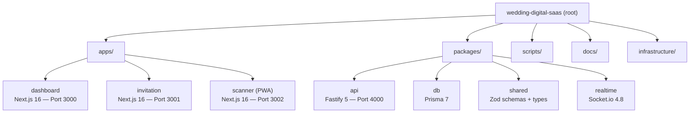

# Codebase Information

## Project Identity

- **Name**: wedding-digital-saas
- **Version**: 0.1.0
- **Description**: Multi-tenant platform for digital wedding invitation management, targeting the Indonesian market
- **License**: Private — All rights reserved
- **Language**: TypeScript 5.9.3
- **Node.js**: >=20.0.0
- **Package Manager**: npm 11.0.0

## Monorepo Structure

## Workspace Packages

| Package | Path | Purpose |
|---------|------|---------|
| `@wedding/dashboard` | `apps/dashboard` | Client & WO management dashboard |
| `@wedding/invitation` | `apps/invitation` | Guest-facing digital invitation |
| `@wedding/scanner` | `apps/scanner` | PWA for QR check-in at venue |
| `@wedding/api` | `packages/api` | REST API + WebSocket backend |
| `@wedding/db` | `packages/db` | Prisma schema, migrations, client |
| `@wedding/shared` | `packages/shared` | Shared types, Zod schemas, utils |
| `@wedding/realtime` | `packages/realtime` | Socket.io real-time server |

## Technology Stack

| Layer | Technology | Version |
|-------|-----------|---------|
| Frontend Framework | Next.js | 16.2.0 |
| UI Library | React | 19.2.0 |
| Styling | TailwindCSS | 4.1.7 |
| Components | shadcn/ui | latest |
| Animation | Motion (Framer Motion) | 12.17.0 |
| QR Scanning | html5-qrcode | 2.3 |
| Forms | React Hook Form | 7.62.0 |
| Data Fetching | @tanstack/react-query | 5.89.0 |
| Backend | Fastify | 5.3.2 |
| ORM | Prisma | 7.7.0 |
| WebSocket | Socket.io | 4.8.3 |
| Cache/PubSub | Redis (ioredis) | 5.6.0 |
| Auth | JWT + bcrypt | 9.0.2 / 6.0.0 |
| Validation | Zod | 3.25.3 |
| Image Processing | Sharp | 0.34.1 |
| Storage | Cloudflare R2 (S3-compatible) | — |
| Testing | Vitest + fast-check | 3.2.4 / 4.2.0 |
| Monorepo | npm workspaces + Turborepo | 2.4.0 |

## Infrastructure

| Service | Platform |
|---------|----------|
| Frontend (3 apps) | Vercel |
| Backend API + WebSocket | Railway |
| Database | Supabase (PostgreSQL) |
| Cache/PubSub | Upstash (Redis) |
| CDN/Storage | Cloudflare R2 |

## Code Quality Tooling

| Tool | Config File | Purpose |
|------|-------------|---------|
| ESLint | `.eslintrc.json` | Linting (TS recommended + prettier) |
| Prettier | `.prettierrc` | Formatting (single quotes, 100 width, trailing commas) |
| Husky | `.husky/pre-commit` | Git hooks — secret detection on commit |
| Turborepo | `turbo.json` | Build orchestration with caching |
| TypeScript | `tsconfig.base.json` | Strict mode, ES2022 target, bundler resolution |

## CI/CD Pipelines

| Workflow | File | Trigger |
|----------|------|---------|
| CI | `ci.yml` | Tests, lint, security audit, type-check |
| Deploy Frontend | `deploy-frontend.yml` | Vercel deploy per changed app |
| Deploy Backend | `deploy-backend.yml` | Railway blue-green deployment |
| Smoke Test | `smoke-test.yml` | Post-deploy HTTP/asset verification |
| Secret Scanning | `secret-scanning.yml` | Detect leaked secrets |

## Scale Constraints

- **Events**: 1 active event at a time
- **Guests**: Max 500 per event
- **Concurrent users**: ~50 peak (check-in time)
- **Single API instance** (no clustering needed)
- **Single Redis instance** (cache + pub/sub shared)
- **Database pool**: 10 connections

## Conventions

- Code language: English (variables, comments)
- UI/content language: Bahasa Indonesia
- Date format: `DD MMMM YYYY`
- Currency: IDR (Rp), no decimals
- Time zone: WIB (Asia/Jakarta, UTC+7)
- All dependency versions pinned (no ^ or ~ in app packages)
