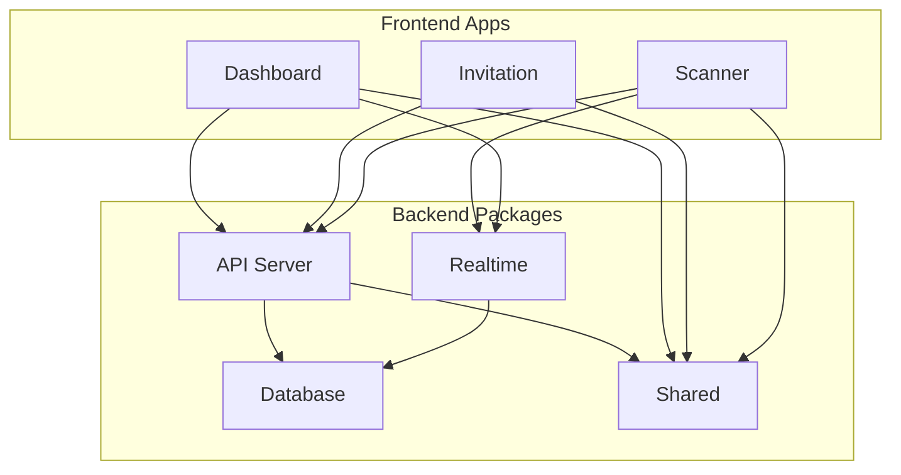
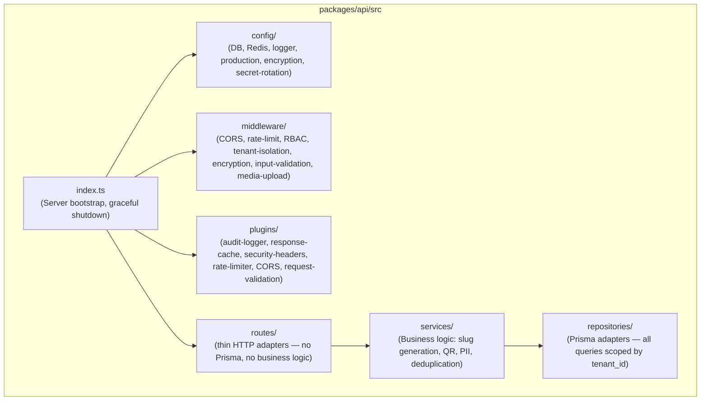
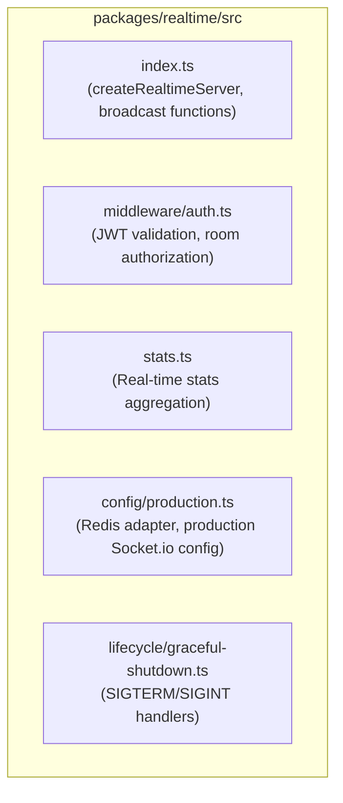
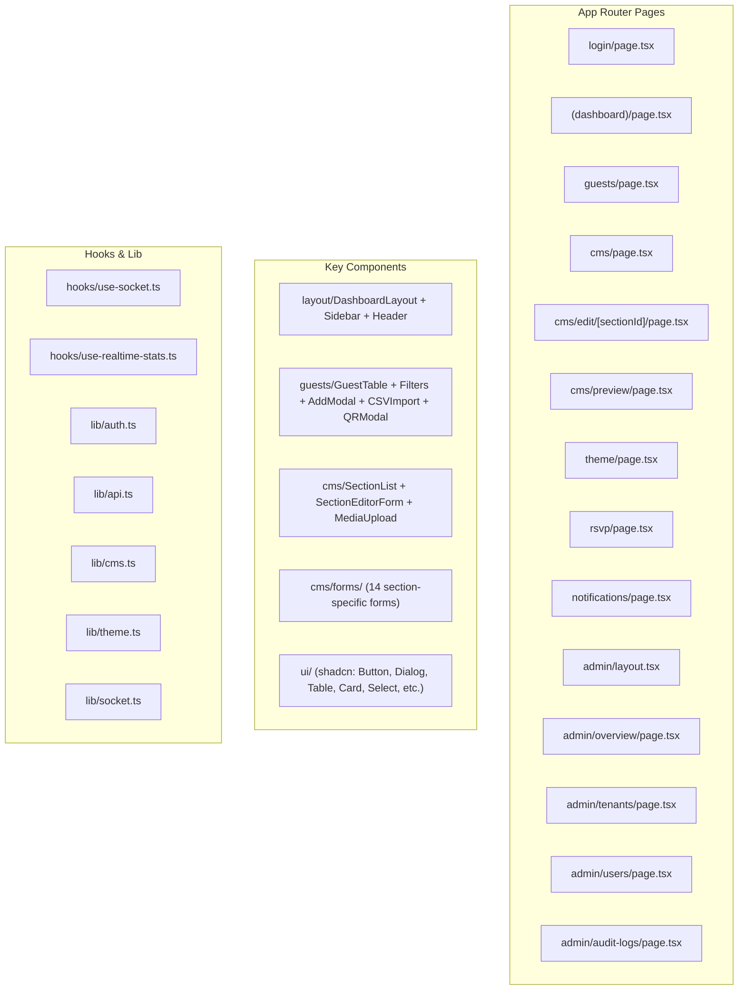
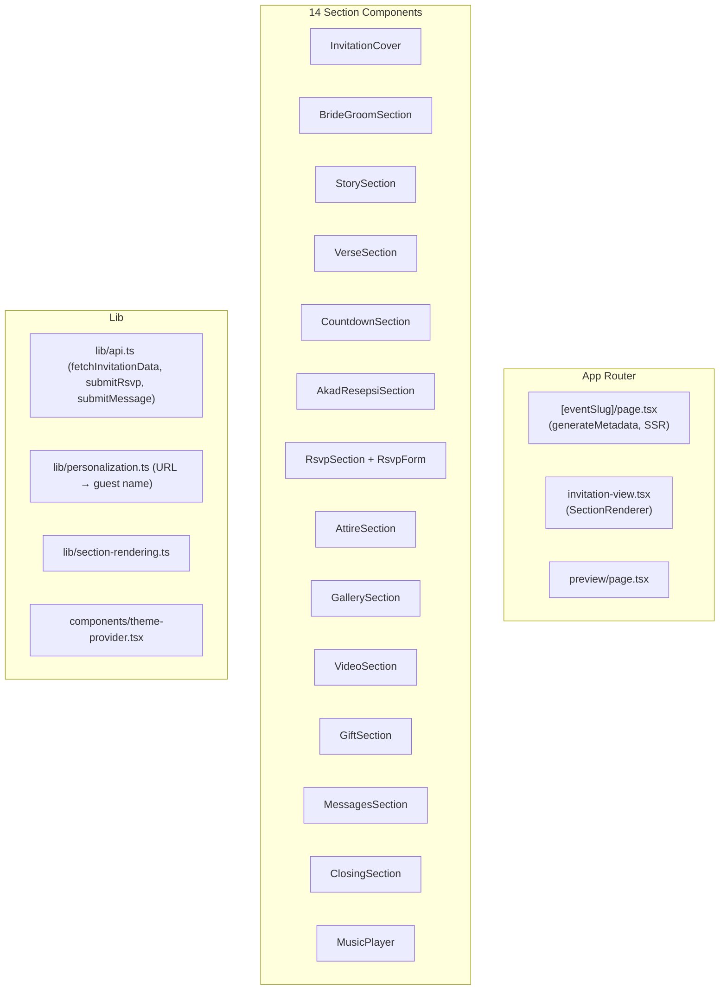
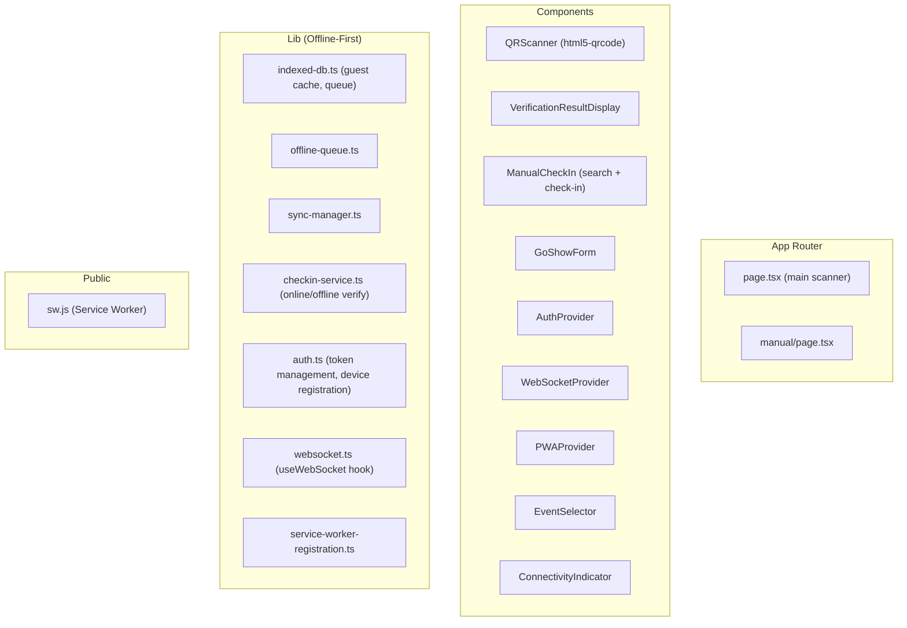

# Components

## Component Map

## Backend Components

### API Server (`packages/api`)

The central backend service handling all REST endpoints and coordinating business logic.

#### Services

| Service | File | Responsibility |
|---------|------|----------------|
| `AuthService` | `auth.service.ts` | Login, JWT generation/verification, password hashing, token refresh, account lockout |
| `GuestService` | `guest.service.ts` | CRUD guests, QR code generation, encrypted payloads, slug generation |
| `CheckInService` | `checkin.service.ts` | QR verification, manual check-in, go-show registration, duplicate detection |
| `RsvpService` | `rsvp.service.ts` | RSVP submission and retrieval |
| `CMSService` | `cms.service.ts` | Section CRUD, sort order management, toggle active state |
| `EventService` | `event.service.ts` | Event creation with default sections and theme |
| `NotificationService` | `notification.service.ts` | Bulk invitation sending (WhatsApp/Email), delivery status tracking |
| `ScannerDeviceService` | `scanner-device.service.ts` | Device registration, lane assignment, heartbeat, max 2 per event |
| `MediaUploadService` | `media-upload.service.ts` | File validation, virus scanning, cloud storage upload |
| `StorageService` | `storage.ts` | R2 client, signed URLs, tenant quota management |
| `GuestImportService` | `guest-import.service.ts` | CSV parsing, bulk import (max 2000 rows), cross-batch deduplication by name within event |
| `AdminService` | `admin.service.ts` | Platform admin features: platform KPIs, tenant management, user listing, password resets, system audit logs |

#### Middleware Stack

| Middleware | Purpose |
|-----------|---------|
| CORS | Per-app origin validation (Dashboard, Invitation, Scanner) |
| Rate Limiter | 100 req/min per tenant (Redis-backed, in-memory fallback) |
| Tenant Isolation | Extract `tenant_id` from JWT, scope all queries |
| RBAC | Role-based route access (Admin, Client, WO, Scanner) |
| Input Validation | Zod schema validation on request bodies |
| PII Encryption | Encrypt/decrypt guest contact info at rest |
| Media Upload | File type/size validation, virus scanning |

#### Plugins

| Plugin | Purpose |
|--------|---------|
| Audit Logger | Auto-log sensitive operations (login, export, bulk actions) |
| Response Cache | Redis-backed caching with pattern-based invalidation on writes |
| Security Headers | HSTS, X-Frame-Options, CSP-ready headers |
| Request Validation | Content-type enforcement, file upload route detection |

### Realtime Server (`packages/realtime`)

**Broadcast Functions**: `broadcastCheckIn`, `broadcastRsvpUpdate`, `broadcastGoShow`, `broadcastStats`

### Database (`packages/db`)

| Component | Purpose |
|-----------|---------|
| `prisma/schema.prisma` | 12 models, 10 enums, multi-tenant schema |
| `prisma/seed.ts` | Demo data seeding (admin + scanner users) |
| `src/client.ts` | Prisma client factory with production pool config |

### Shared (`packages/shared`)

| Component | Purpose |
|-----------|---------|
| `types/validation.ts` | Zod schemas for all input validation |
| `types/interfaces.ts` | TypeScript interfaces for domain entities |
| `types/enums.ts` | 11 enums (UserRole, GuestGroup, SectionType, etc.) |
| `types/responses.ts` | API response type definitions |
| `types/errors.ts` | ErrorCode enum for standardized error handling |
| `utils/sanitize.ts` | HTML sanitization for user-generated content |

## Frontend Components

### Dashboard (`apps/dashboard`)

### Invitation (`apps/invitation`)

### Scanner (`apps/scanner`)

## Cross-Cutting Concerns

| Concern | Implementation |
|---------|---------------|
| Authentication | JWT tokens validated in API middleware and WebSocket handshake |
| Tenant Isolation | Middleware injects `tenant_id` into all service calls |
| Real-time Updates | Socket.io rooms scoped per event, broadcast on state changes |
| Offline Support | Scanner: IndexedDB queue + service worker + background sync |
| Input Validation | Zod schemas in `packages/shared`, enforced in API middleware |
| Error Handling | Standardized `ErrorCode` enum, typed error responses |
| Caching | Redis response cache with pattern-based invalidation |
| Audit Logging | Auto-logged for sensitive operations |
