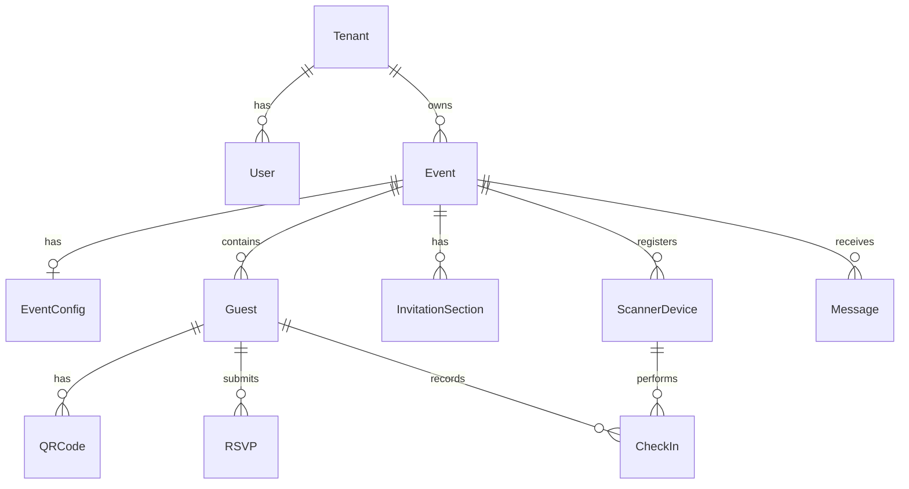
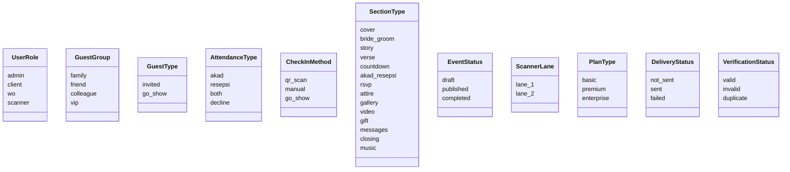

# Data Models

## Entity Relationship Diagram



## Models

### Tenant

Multi-tenant root entity representing a business client.

| Field | Type | Constraints | Description |
|-------|------|-------------|-------------|
| `id` | UUID | PK | Unique identifier |
| `name` | String | Required | Business name |
| `slug` | String | Unique | URL-friendly identifier |
| `plan_type` | PlanType | Default: `basic` | Subscription tier |
| `is_active` | Boolean | Default: `true` | Account status |
| `created_at` | DateTime | Auto | Creation timestamp |

### User

Platform user with role-based access, scoped to a tenant.

| Field | Type | Constraints | Description |
|-------|------|-------------|-------------|
| `id` | UUID | PK | Unique identifier |
| `tenant_id` | UUID | FK → Tenant | Owning tenant |
| `email` | String | Unique per tenant | Login email |
| `password_hash` | String | Required | bcrypt hash |
| `role` | UserRole | Required | Access level |
| `name` | String | Required | Display name |
| `created_at` | DateTime | Auto | Creation timestamp |

**Indexes**: `[tenant_id]`, Unique `[tenant_id, email]`

### Event

Wedding event owned by a tenant.

| Field | Type | Constraints | Description |
|-------|------|-------------|-------------|
| `id` | UUID | PK | Unique identifier |
| `tenant_id` | UUID | FK → Tenant | Owning tenant |
| `slug` | String | Unique | URL slug for invitation |
| `bride_name` | String | Required | Bride's name |
| `groom_name` | String | Required | Groom's name |
| `event_date` | DateTime | Required | Wedding date |
| `venue_name` | String | Required | Venue name |
| `venue_address` | String | Required | Full address |
| `venue_maps_url` | String | Required | Google Maps link |
| `akad_start` | String | Required | Akad ceremony start time |
| `akad_end` | String | Required | Akad ceremony end time |
| `resepsi_start` | String | Required | Reception start time |
| `resepsi_end` | String | Required | Reception end time |
| `status` | EventStatus | Default: `draft` | Publication state |
| `created_at` | DateTime | Auto | Creation timestamp |

**Indexes**: `[tenant_id]`, `[slug]`

### EventConfig

Event configuration including theme and section settings.

| Field | Type | Constraints | Description |
|-------|------|-------------|-------------|
| `id` | UUID | PK | Unique identifier |
| `event_id` | UUID | FK → Event, Unique | One config per event |
| `theme_config` | JSON | Required | Theme colors and fonts |
| `active_sections` | JSON | Required | Enabled section types |
| `invitation_music_url` | String? | Optional | Background music URL |
| `calendar_link` | String? | Optional | Calendar download link |
| `max_scanner_devices` | Int | Default: `2` | Max scanners per event |
| `max_guests` | Int | Default: `2000` | Guest capacity limit |
| `updated_at` | DateTime | Auto-update | Last modification |

### Guest

Guest record within an event, directly tenant-scoped for query performance.

| Field | Type | Constraints | Description |
|-------|------|-------------|-------------|
| `id` | UUID | PK | Unique identifier |
| `event_id` | UUID | FK → Event | Parent event |
| `tenant_id` | UUID | Required | Denormalized for fast filtering |
| `name` | String | Required | Guest full name |
| `slug` | String | Required | URL-friendly name |
| `phone` | String? | Optional | Phone (encrypted at rest) |
| `email` | String? | Optional | Email (encrypted at rest) |
| `group` | GuestGroup | Required | Categorization |
| `type` | GuestType | Default: `invited` | Invited vs go-show |
| `plus_one_count` | Int | Default: `0` | Additional guests |
| `invitation_url` | String? | Optional | Generated invitation link |
| `delivery_status` | DeliveryStatus | Default: `not_sent` | Notification status |
| `created_at` | DateTime | Auto | Creation timestamp |

**Indexes**: `[tenant_id]`, `[event_id]`, `[slug]`, Unique `[event_id, slug]`

### QRCode

QR code associated with a guest for check-in verification.

| Field | Type | Constraints | Description |
|-------|------|-------------|-------------|
| `id` | UUID | PK | Unique identifier |
| `guest_id` | UUID | FK → Guest | Owning guest |
| `qr_payload` | String | Unique | Encrypted payload (guest_id + event_id) |
| `qr_image_url` | String? | Optional | Generated QR image URL |
| `is_active` | Boolean | Default: `true` | Can be deactivated |
| `generated_at` | DateTime | Auto | Generation timestamp |

**Indexes**: `[guest_id]`, `[qr_payload]`

### RSVP

RSVP submission from a guest (public, no auth required).

| Field | Type | Constraints | Description |
|-------|------|-------------|-------------|
| `id` | UUID | PK | Unique identifier |
| `guest_id` | UUID | FK → Guest | Responding guest |
| `attendance` | AttendanceType | Required | Akad/Resepsi/Both/Decline |
| `guest_count` | Int | Required | Total attendees including plus-ones |
| `submitted_at` | DateTime | Auto | Submission timestamp |

**Indexes**: `[guest_id]`

### CheckIn

Check-in record for a guest at the venue.

| Field | Type | Constraints | Description |
|-------|------|-------------|-------------|
| `id` | UUID | PK | Unique identifier |
| `guest_id` | UUID | FK → Guest | Checked-in guest |
| `scanner_device_id` | UUID? | FK → ScannerDevice | Device that performed check-in |
| `method` | CheckInMethod | Required | qr_scan / manual / go_show |
| `checked_in_at` | DateTime | Auto | Check-in timestamp |

**Indexes**: `[guest_id]`, `[checked_in_at]`

### InvitationSection

CMS section for an invitation (14 section types).

| Field | Type | Constraints | Description |
|-------|------|-------------|-------------|
| `id` | UUID | PK | Unique identifier |
| `event_id` | UUID | FK → Event | Parent event |
| `section_type` | SectionType | Required | One of 14 types |
| `sort_order` | Int | Required | Display order |
| `is_active` | Boolean | Default: `true` | Visibility toggle |
| `content` | JSON | Default: `{}` | Section-specific content |
| `updated_at` | DateTime | Auto-update | Last modification |

**Indexes**: `[event_id]`, Unique `[event_id, sort_order]`

### ScannerDevice

Scanner device registered for an event (max 2 per event).

| Field | Type | Constraints | Description |
|-------|------|-------------|-------------|
| `id` | UUID | PK | Unique identifier |
| `event_id` | UUID | FK → Event | Parent event |
| `device_name` | String | Required | Device identifier |
| `lane` | ScannerLane | Required | lane_1 or lane_2 |
| `is_active` | Boolean | Default: `true` | Active status |
| `last_active_at` | DateTime | Auto | Last heartbeat |

**Indexes**: `[event_id]`

### Message

Guest message/wish for the couple (public submission).

| Field | Type | Constraints | Description |
|-------|------|-------------|-------------|
| `id` | UUID | PK | Unique identifier |
| `event_id` | UUID | FK → Event | Parent event |
| `sender_name` | String | Required | Sender display name |
| `message_text` | String | Required | Message content (sanitized) |
| `created_at` | DateTime | Auto | Submission timestamp |
| `is_visible` | Boolean | Default: `true` | Moderation flag |

**Indexes**: `[event_id]`

## Enums



## JSON Field Schemas

### ThemeConfig (EventConfig.theme_config)

```typescript
{
  dashboard: {
    primary_color: string;    // hex
    secondary_color: string;
    accent_color: string;
    surface_color: string;
    text_color: string;
    font_family: string;
    font_heading: string;
  };
  invitation: {
    primary_color: string;
    secondary_color: string;
    accent_color: string;
    background_color: string;
    text_color: string;
    font_family: string;
    font_heading: string;
    template_id: string;
  };
}
```

### InvitationSection.content (varies by section_type)

Content is a flexible JSON object whose shape depends on the `section_type`. Examples:

- **cover**: `{ title, subtitle, background_image_url }`
- **bride_groom**: `{ bride: {name, parents, photo_url}, groom: {...} }`
- **akad_resepsi**: `{ akad: {date, time, venue}, resepsi: {...} }`
- **gallery**: `{ images: [{url, caption}] }`
- **gift**: `{ accounts: [{bank, account_number, name}] }`

## Data Access Patterns

| Pattern | Implementation |
|---------|---------------|
| Tenant scoping | All queries include `WHERE tenant_id = ?` via middleware |
| Guest lookup by QR | Index on `qr_codes.qr_payload` for O(1) lookup |
| Guest lookup by slug | Index on `guests.slug` for invitation personalization |
| Duplicate check-in detection | Query `check_ins WHERE guest_id = ?` before insert |
| Section ordering | Unique constraint on `[event_id, sort_order]` |
| PII encryption | Guest phone/email encrypted at rest, decrypted in service layer |
