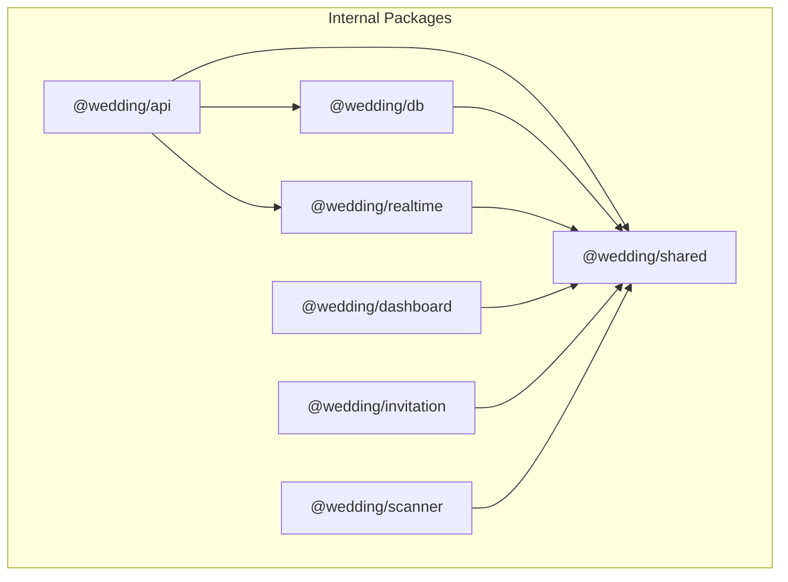
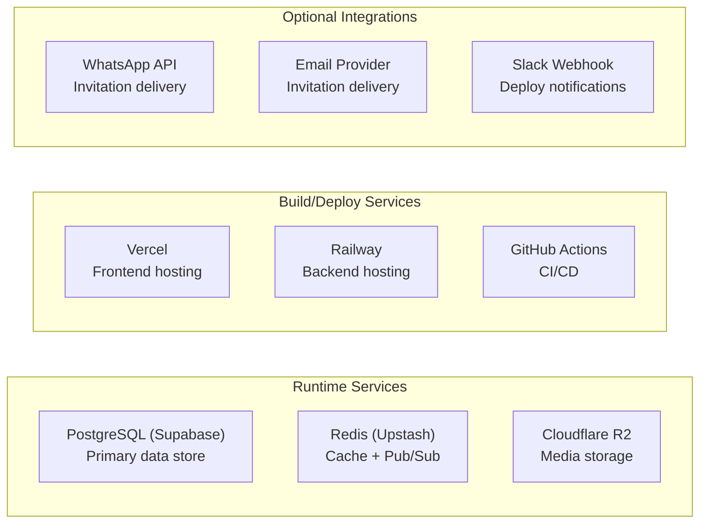

# Dependencies

## Dependency Graph

## Production Dependencies by Package

### @wedding/api (Backend)

| Package | Version | Purpose |
|---------|---------|---------|
| `fastify` | 5.8.5 | HTTP framework (high-performance, schema-based) |
| `fastify-plugin` | 5.0.1 | Plugin encapsulation |
| `socket.io` | 4.8.3 | WebSocket server for real-time events |
| `ioredis` | 5.10.1 | Redis client (caching, rate limiting, pub/sub) |
| `@prisma/client` | 7.7.0 | Database ORM (via @wedding/db) |
| `jsonwebtoken` | 9.0.3 | JWT token generation and verification |
| `bcrypt` | 6.0.0 | Password hashing |
| `zod` | 3.25.3 | Runtime input validation |
| `sharp` | 0.34.5 | Image processing (resize, format conversion) |
| `multer` | 1.4.5-lts.2 | Multipart file upload handling |
| `@aws-sdk/client-s3` | 3.777.0 | Cloudflare R2 storage (S3-compatible) |
| `@aws-sdk/s3-request-presigner` | 3.777.0 | Signed URL generation for media |

### @wedding/db (Database)

| Package | Version | Purpose |
|---------|---------|---------|
| `@prisma/client` | 7.7.0 | Generated database client |
| `@prisma/adapter-pg` | 7.7.0 | PostgreSQL adapter for Prisma |
| `pg` | 8.16.0 | PostgreSQL driver |
| `dotenv` | 16.5.0 | Environment variable loading |

### @wedding/realtime (WebSocket)

| Package | Version | Purpose |
|---------|---------|---------|
| `socket.io` | 4.8.3 | WebSocket server |
| `@socket.io/redis-adapter` | 8.3.0 | Redis adapter for horizontal scaling (future) |
| `ioredis` | 5.10.1 | Redis client for adapter |
| `jsonwebtoken` | 9.0.2 | JWT validation on WebSocket handshake |

### @wedding/shared (Types & Utils)

| Package | Version | Purpose |
|---------|---------|---------|
| `zod` | 3.25.3 | Schema definitions shared across all packages |
| `sanitize-html` | 2.16.0 | HTML sanitization for user-generated content |

### @wedding/dashboard (Frontend)

| Package | Version | Purpose |
|---------|---------|---------|
| `next` | 16.2.6 | React framework (App Router, SSR) |
| `react` / `react-dom` | 19.2.6 | UI library |
| `@tanstack/react-query` | 5.100.10 | Server state management, caching |
| `react-hook-form` | 7.75.0 | Form state management |
| `socket.io-client` | 4.8.3 | WebSocket client for real-time updates |
| `zod` | 3.25.3 | Client-side validation |
| `radix-ui` | 1.4.3 | Accessible UI primitives (via shadcn/ui) |
| `class-variance-authority` | 0.7.1 | Component variant styling |
| `clsx` | 2.1.1 | Conditional class names |
| `tailwind-merge` | 3.6.0 | Merge Tailwind classes without conflicts |
| `lucide-react` | 1.14.0 | Icon library |
| `sonner` | 2.0.7 | Toast notifications |
| `next-themes` | 0.4.6 | Theme switching (dark/light) |
| `shadcn` | 4.7.0 | Component CLI |
| `tw-animate-css` | 1.4.0 | Animation utilities |

### @wedding/invitation (Frontend)

| Package | Version | Purpose |
|---------|---------|---------|
| `next` | 16.2.6 | React framework (SSR for performance) |
| `react` / `react-dom` | 19.2.6 | UI library |
| `motion` | 12.38.0 | Animation library (section transitions) |
| `react-hook-form` | 7.75.0 | RSVP form handling |
| `@hookform/resolvers` | 5.2.2 | Zod resolver for react-hook-form |
| `zod` | 3.25.3 | RSVP form validation |
| `clsx` | 2.1.1 | Conditional class names |
| `tailwind-merge` | 3.3.0 | Merge Tailwind classes |

### @wedding/scanner (Frontend PWA)

| Package | Version | Purpose |
|---------|---------|---------|
| `next` | 16.2.6 | React framework |
| `react` / `react-dom` | 19.2.6 | UI library |
| `html5-qrcode` | 2.3.8 | Camera-based QR code scanning |
| `socket.io-client` | 4.8.3 | Real-time sync between scanner devices |
| `zod` | 3.25.3 | Input validation |

## Dev Dependencies (Shared Across Workspace)

| Package | Version | Purpose |
|---------|---------|---------|
| `typescript` | 5.9.3 | Type system |
| `vitest` | 3.2.4 | Test runner |
| `fast-check` | 4.8.0 | Property-based testing |
| `tailwindcss` | 4.3.0 | Utility-first CSS |
| `@tailwindcss/postcss` | 4.3.0 | PostCSS integration |
| `postcss` | 8.5.3 | CSS processing |
| `prettier` | 3.8.3 | Code formatting |
| `prettier-plugin-tailwindcss` | 0.8.0 | Tailwind class sorting |
| `tsx` | 4.20.3 | TypeScript execution (dev server, scripts) |
| `pino-pretty` | 13.1.3 | Dev log formatting |
| `eslint` | 9.0.0 | Linting |
| `@typescript-eslint/*` | 8.0.0 | TypeScript ESLint rules |
| `husky` | 9.1.7 | Git hooks |
| `turbo` | 2.4.0 | Monorepo build orchestration |
| `prisma` | 7.7.0 | Schema management, migrations |

## External Services

## Dependency Update Strategy

- All app-level dependencies use **pinned versions** (no `^` or `~`)
- Root devDependencies use `^` ranges for tooling flexibility
- `overrides` in frontend apps pin `@types/react` to avoid version conflicts
- `postinstall` script auto-generates Prisma client on `npm install`

## Security Considerations

| Dependency | Security Feature |
|-----------|-----------------|
| `bcrypt` | Salted password hashing (cost factor 10) |
| `jsonwebtoken` | Short-lived access tokens (15min) |
| `sanitize-html` | XSS prevention on user content |
| `zod` | Input validation prevents injection |
| `ioredis` | TLS connections in production (`rediss://`) |
| `@prisma/client` | Parameterized queries (SQL injection prevention) |
| `sharp` | Safe image processing (no arbitrary code execution) |
