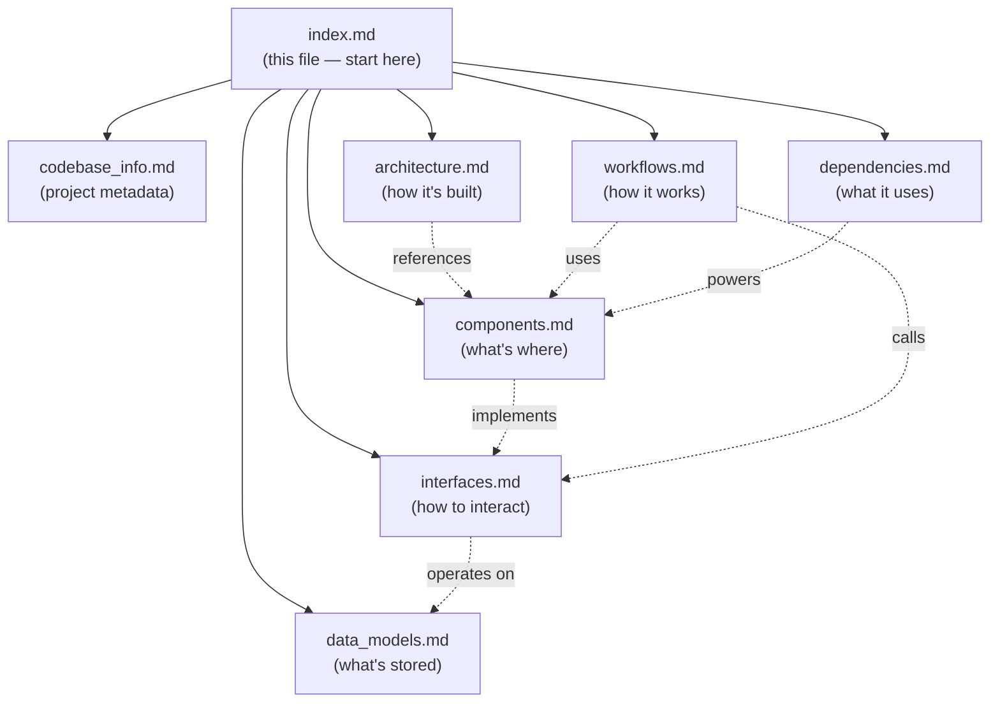

# Documentation Index

> **For AI Assistants**: This file is your primary entry point. It contains metadata about all documentation files so you can determine which file to consult for specific questions without reading every document. Use this as a lookup table.

## Project Summary

**Wedding Digital SaaS** — A multi-tenant platform for digital wedding invitation management targeting the Indonesian market. Monorepo with 3 frontend apps (Dashboard, Invitation, Scanner PWA) sharing a single Fastify backend, PostgreSQL database, Redis cache, and Socket.io real-time server.

## Documentation Files

### codebase_info.md
**Purpose**: Project identity, tech stack, infrastructure, tooling, and conventions.
**Consult when**: You need to know the project name, version, language, framework versions, deployment platforms, code quality tools, CI/CD pipelines, scale constraints, or coding conventions (language, date format, currency).
**Key content**: Monorepo structure diagram, workspace package list, full tech stack table, infrastructure mapping, CI/CD workflow list, scale constraints (1 event, 500 guests max).

### architecture.md
**Purpose**: System architecture, design patterns, and key technical decisions.
**Consult when**: You need to understand how components connect, data flows between services, why certain architectural choices were made, or how security/deployment works at a high level.
**Key content**: System topology diagram, multi-tenant isolation pattern, layered backend architecture, frontend architecture per app, real-time (Socket.io rooms), offline-first (Scanner PWA), CMS-driven rendering, security architecture, deployment (blue-green), design decision rationale table.

### components.md
**Purpose**: Major components, their responsibilities, and internal structure.
**Consult when**: You need to find where specific functionality lives, understand what a service/middleware/plugin does, or navigate the codebase to locate relevant code.
**Key content**: Backend services table (11 services with file paths), middleware stack (7 layers), plugins (4), realtime server structure, database package, shared package exports, frontend component trees for all 3 apps (pages, components, hooks, lib).

### interfaces.md
**Purpose**: All APIs, interfaces, and integration points.
**Consult when**: You need to know API endpoints, request/response formats, WebSocket events, URL patterns, error codes, or how packages communicate internally.
**Key content**: Complete REST API table (all endpoints with methods, auth, roles), API response format (ApiSuccess/PaginatedResponse/ApiError), WebSocket events table, invitation URL pattern, internal package dependency interfaces, error code prefix conventions.

### data_models.md
**Purpose**: Database schema, data structures, and access patterns.
**Consult when**: You need to understand the data model, field types/constraints, relationships between entities, enum values, JSON field schemas, or how data is queried.
**Key content**: ER diagram, 10 model definitions with all fields/types/constraints/indexes, 11 enum definitions, JSON schemas for ThemeConfig and section content, data access pattern table.

### workflows.md
**Purpose**: Key processes and user/system workflows.
**Consult when**: You need to understand how a feature works end-to-end, the sequence of operations for a user action, or how different components interact during a workflow.
**Key content**: Sequence diagrams for: authentication (login + refresh), guest management (add + CSV import), RSVP submission, QR check-in (3 states), offline check-in + sync, go-show registration, CMS section management, invitation rendering (SSR), notification sending (bulk), deployment (CI/CD + blue-green), scanner device registration, real-time stats aggregation.

### dependencies.md
**Purpose**: External dependencies, their versions, and usage rationale.
**Consult when**: You need to know what libraries are used, their versions, why they were chosen, how they relate to each other, or security considerations around dependencies.
**Key content**: Internal dependency graph, production dependencies per package (with version + purpose), shared dev dependencies, external services diagram, dependency update strategy (pinned versions), security considerations table.

### testing.md
**Purpose**: Test patterns, conventions, and property-based testing strategies.
**Consult when**: You need to write tests, understand existing test patterns, know what properties are verified, or set up mocks/fixtures for a new service.
**Key content**: Test distribution per package, file naming conventions, 6 testing patterns (repository mocking, factory functions, property-based with fast-check, in-memory implementations, middleware testing, WebSocket testing), property-based coverage table, integration test patterns.

## Quick Reference: Which File to Read

| Question Type | File |
|---------------|------|
| "What tech stack/version is used?" | `codebase_info.md` |
| "How do components connect?" | `architecture.md` |
| "Where is X implemented?" | `components.md` |
| "What's the API for X?" | `interfaces.md` |
| "What fields does model X have?" | `data_models.md` |
| "How does feature X work end-to-end?" | `workflows.md` |
| "What library is used for X?" | `dependencies.md` |
| "How do I write tests for X?" | `testing.md` |
| "What are the deployment steps?" | `architecture.md` → `workflows.md` |
| "How is auth/security handled?" | `architecture.md` → `interfaces.md` |
| "What are the project conventions?" | `codebase_info.md` |

## File Relationships

## Usage Tips for AI Assistants

1. **Start here** — This index has enough context to determine which file answers a question
2. **Read selectively** — Only load the specific file(s) relevant to the current task
3. **Cross-reference** — Workflows reference components and interfaces; follow the links
4. **For implementation tasks** — Read `components.md` first to locate code, then `interfaces.md` for contracts
5. **For debugging** — Read `workflows.md` to understand the expected flow, then `components.md` to find the code
6. **For new features** — Read `architecture.md` for patterns to follow, `data_models.md` for schema, `interfaces.md` for API conventions
