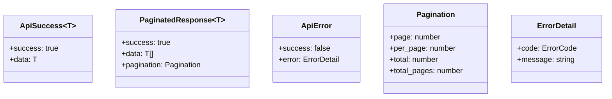
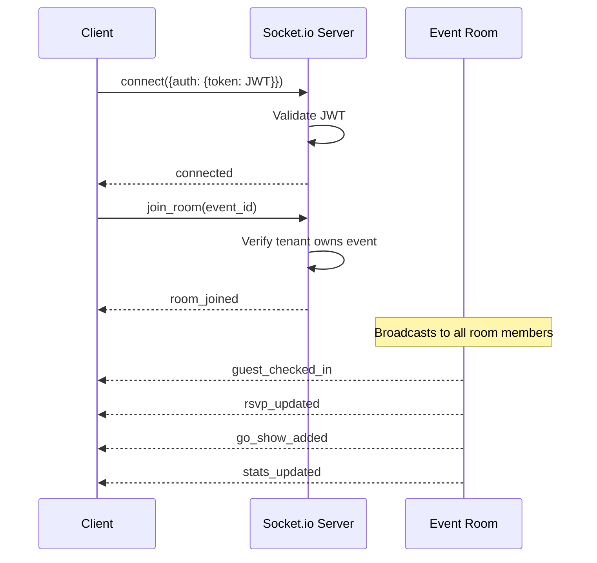
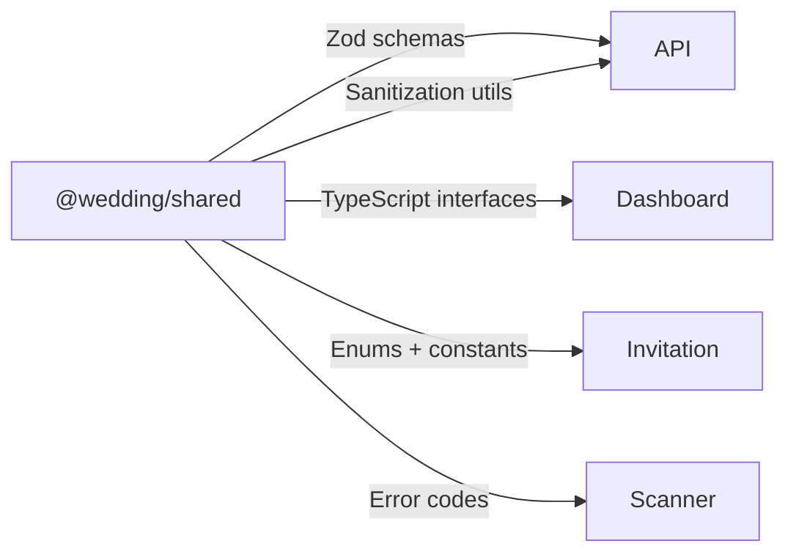
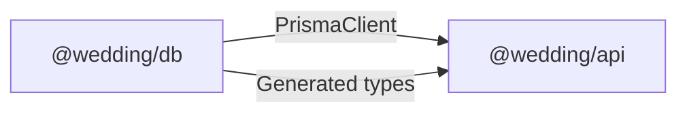
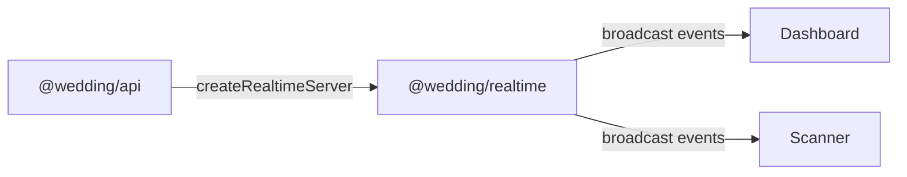

# Interfaces

## REST API Endpoints

Base URL: `http://localhost:4000` (dev) / `https://api.domain.railway.app` (prod)

### Authentication

| Method | Endpoint | Auth | Description |
|--------|----------|------|-------------|
| POST | `/auth/login` | None | Login, returns JWT tokens |
| POST | `/auth/refresh` | Refresh token | Refresh access token |
| POST | `/auth/logout` | Access token | Revoke refresh token |

### Events

| Method | Endpoint | Auth | Roles | Description |
|--------|----------|------|-------|-------------|
| GET | `/events` | JWT | Admin, Client, WO | List tenant events |
| POST | `/events` | JWT | Admin, Client | Create event |
| GET | `/events/:id` | JWT | Admin, Client, WO | Get event details |
| PUT | `/events/:id` | JWT | Admin, Client | Update event |
| DELETE | `/events/:id` | JWT | Admin | Delete event |

### Guests

| Method | Endpoint | Auth | Roles | Description |
|--------|----------|------|-------|-------------|
| GET | `/events/:eventId/guests` | JWT | Admin, Client, WO | List guests (paginated) |
| POST | `/events/:eventId/guests` | JWT | Admin, Client, WO | Add guest |
| GET | `/events/:eventId/guests/:id` | JWT | Admin, Client, WO | Get guest details |
| PUT | `/events/:eventId/guests/:id` | JWT | Admin, Client, WO | Update guest |
| DELETE | `/events/:eventId/guests/:id` | JWT | Admin, Client | Delete guest |
| POST | `/events/:eventId/guests/import` | JWT | Admin, Client | CSV bulk import (max 2000) |
| GET | `/events/:eventId/guests/:id/qr` | JWT | Admin, Client, WO | Get QR code image |

### RSVP

| Method | Endpoint | Auth | Description |
|--------|----------|------|-------------|
| POST | `/events/:eventId/rsvp` | None (public) | Submit RSVP |
| GET | `/events/:eventId/rsvp/:guestId` | JWT | Get RSVP status |

### Check-in

| Method | Endpoint | Auth | Roles | Description |
|--------|----------|------|-------|-------------|
| POST | `/events/:eventId/checkin/verify` | JWT | Scanner | Verify QR scan |
| POST | `/events/:eventId/checkin/manual` | JWT | Scanner | Manual check-in by name |
| POST | `/events/:eventId/checkin/go-show` | JWT | Scanner | Register walk-in guest |
| GET | `/events/:eventId/checkin/search` | JWT | Scanner | Search guests for manual check-in |

### CMS (Invitation Sections)

| Method | Endpoint | Auth | Roles | Description |
|--------|----------|------|-------|-------------|
| GET | `/events/:eventId/sections` | JWT | Admin, Client | List all sections |
| GET | `/events/:eventId/sections/active` | None (public) | — | List active sections (for invitation) |
| POST | `/events/:eventId/sections` | JWT | Admin, Client | Create section |
| GET | `/events/:eventId/sections/:id` | JWT | Admin, Client | Get section |
| PUT | `/events/:eventId/sections/:id/content` | JWT | Admin, Client | Update section content |
| PUT | `/events/:eventId/sections/:id/toggle` | JWT | Admin, Client | Toggle section active |
| PUT | `/events/:eventId/sections/sort` | JWT | Admin, Client | Reorder sections |
| DELETE | `/events/:eventId/sections/:id` | JWT | Admin | Delete section |

### Scanner Devices

| Method | Endpoint | Auth | Roles | Description |
|--------|----------|------|-------|-------------|
| POST | `/events/:eventId/scanner/register` | JWT | Scanner | Register device (max 2) |
| POST | `/events/:eventId/scanner/heartbeat` | JWT | Scanner | Device heartbeat |
| DELETE | `/events/:eventId/scanner/:deviceId` | JWT | Scanner | Deactivate device |
| GET | `/events/:eventId/scanner/devices` | JWT | Admin, WO | List active devices |

### Notifications

| Method | Endpoint | Auth | Roles | Description |
|--------|----------|------|-------|-------------|
| POST | `/events/:eventId/notifications/send` | JWT | Admin, Client | Send invitation to guest |
| POST | `/events/:eventId/notifications/bulk` | JWT | Admin, Client | Bulk send (max 500) |
| GET | `/events/:eventId/notifications/status` | JWT | Admin, Client | Delivery status |

### Messages (Wishes)

| Method | Endpoint | Auth | Description |
|--------|----------|------|-------------|
| GET | `/events/:eventId/messages` | None (public) | List visible messages |
| POST | `/events/:eventId/messages` | None (public) | Submit message/wish |

### Invitations (Public)

| Method | Endpoint | Auth | Description |
|--------|----------|------|-------------|
| GET | `/invitations/:slug` | None | Get invitation data by event slug |

### Health

| Method | Endpoint | Auth | Description |
|--------|----------|------|-------------|
| GET | `/health` | None | System health (PostgreSQL, Redis, WebSocket) |

## API Response Format

## WebSocket Interface

**Connection**: `wss://api.domain/` with JWT in handshake auth

### WebSocket Events

| Event | Direction | Payload | Description |
|-------|-----------|---------|-------------|
| `guest_checked_in` | Server→Client | `{guest_id, guest_name, group, method, checked_in_at}` | Guest checked in |
| `rsvp_updated` | Server→Client | `{guest_id, attendance, guest_count}` | RSVP submitted/updated |
| `go_show_added` | Server→Client | `{guest_id, guest_name}` | Walk-in guest registered |
| `stats_updated` | Server→Client | `EventStats` | Aggregated stats refresh |
| `join_room` | Client→Server | `event_id` | Join event room |
| `leave_room` | Client→Server | `event_id` | Leave event room |

## Invitation URL Interface

Public URL pattern: `/{event-slug}?to={guest-slug}`

- `event-slug`: Unique event identifier (e.g., `andi-sari-wedding`)
- `guest-slug`: Guest name slugified (e.g., `budi-santoso`)
- The `to` parameter personalizes the cover with the guest's name
- No authentication required

## Internal Package Interfaces

### Shared → All Packages

### DB → API

### Realtime → API + Frontend

## Error Code Interface

Error codes follow the pattern `{DOMAIN}_{NUMBER}`:

| Prefix | Domain | Examples |
|--------|--------|----------|
| `AUTH_` | Authentication | `AUTH_2001` (invalid credentials), `AUTH_2003` (account locked) |
| `VAL_` | Validation | `VAL_4001` (missing field), `VAL_4002` (invalid format) |
| `TENANT_` | Tenant isolation | `TENANT_5001` (access denied) |
| `GUEST_` | Guest operations | `GUEST_6001` (not found), `GUEST_6002` (duplicate) |
| `SCAN_` | Scanner/Check-in | `SCAN_7001` (invalid QR), `SCAN_7002` (already checked in) |
| `CMS_` | CMS operations | `CMS_8001` (section not found) |
| `RATE_` | Rate limiting | `RATE_9001` (too many requests) |
