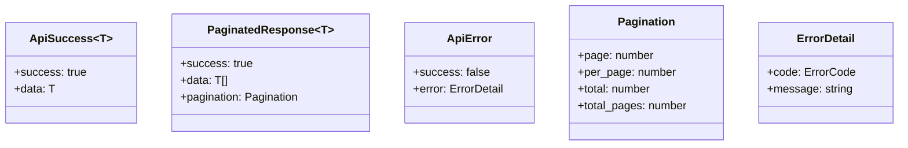
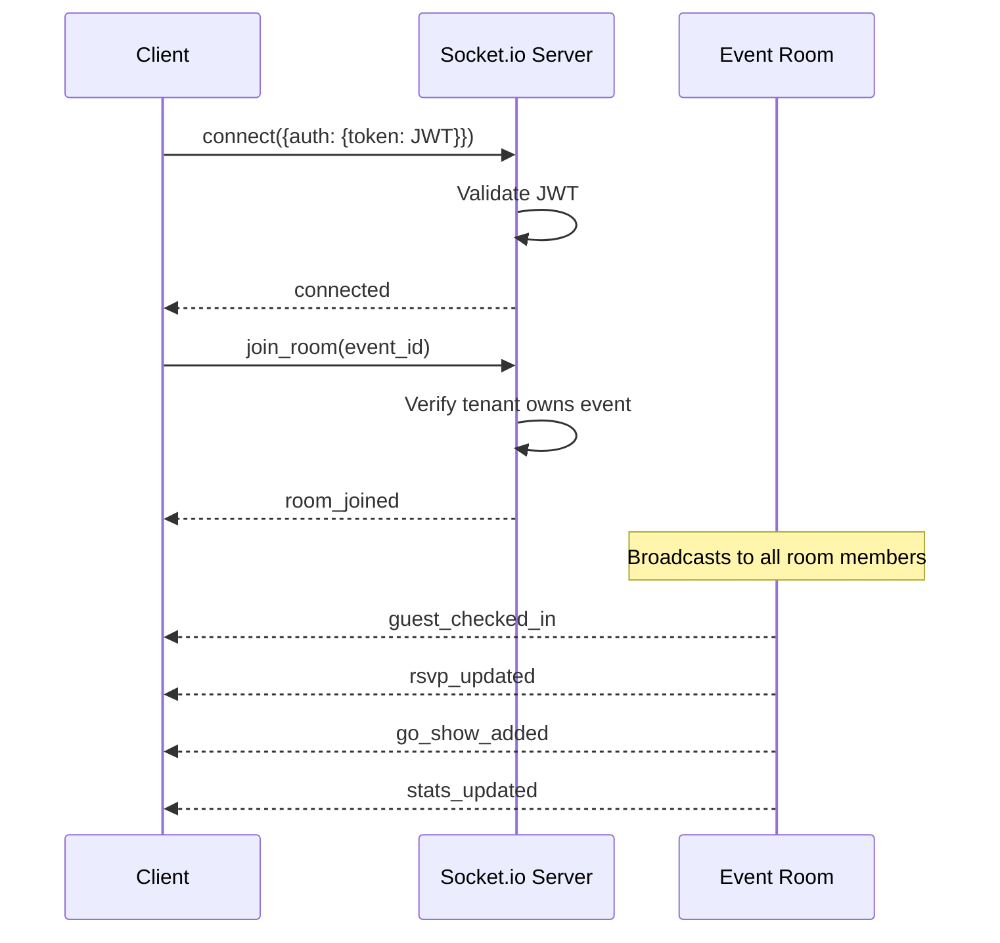
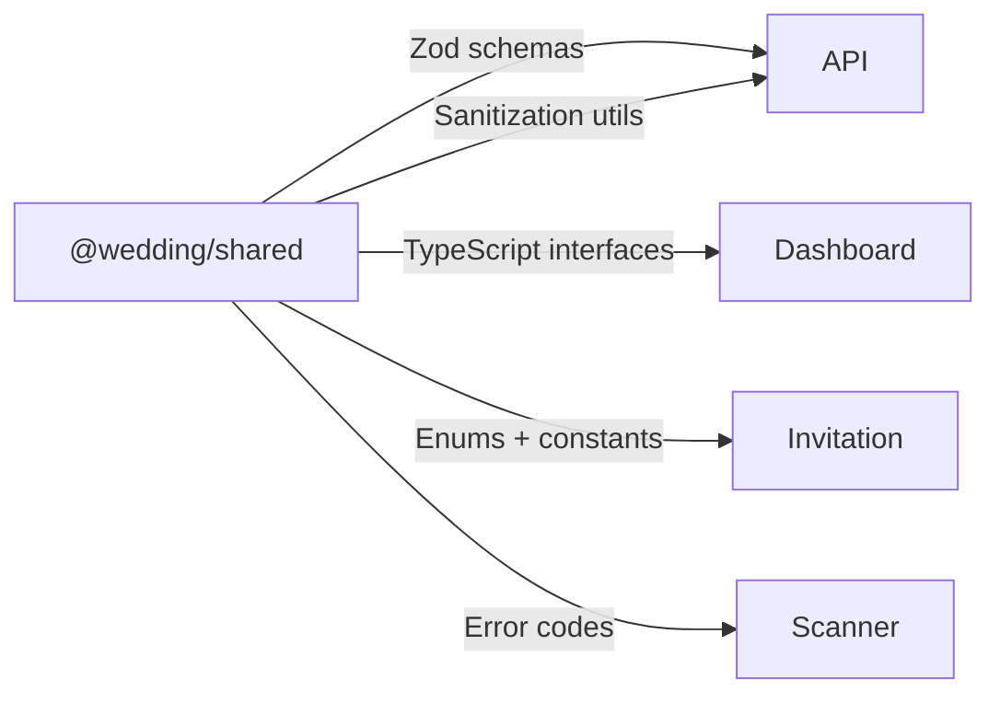
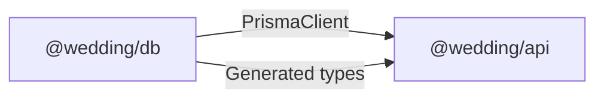
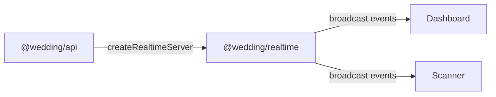

# Interfaces

## REST API Endpoints

Base URL: `http://localhost:4000` (dev) / `https://api.domain.railway.app` (prod)

### Authentication (prefix: `/auth`)

| Method | Endpoint        | Auth          | Description               |
| ------ | --------------- | ------------- | ------------------------- |
| POST   | `/auth/login`   | None          | Login, returns JWT tokens |
| POST   | `/auth/refresh` | Refresh token | Refresh access token      |

### Events (prefix: `/events`)

| Method | Endpoint                   | Auth | Description                                     |
| ------ | -------------------------- | ---- | ----------------------------------------------- |
| GET    | `/events/current`          | JWT  | Get current tenant's latest event               |
| GET    | `/events/:id/stats`        | JWT  | Get event statistics (guests, RSVPs, check-ins) |
| GET    | `/events/:id/rsvp`         | JWT  | Get RSVP summary for event                      |
| POST   | `/events/:id/media/upload` | JWT  | Upload media for event                          |

### Guests (prefix: `/guests`)

| Method | Endpoint         | Auth | Description                                    |
| ------ | ---------------- | ---- | ---------------------------------------------- |
| GET    | `/guests`        | JWT  | List guests (paginated, filterable)            |
| POST   | `/guests`        | JWT  | Create guest (auto-generates QR)               |
| PUT    | `/guests/:id`    | JWT  | Update guest                                   |
| DELETE | `/guests/:id`    | JWT  | Delete guest and associated QR code            |
| GET    | `/guests/:id/qr` | JWT  | Get guest QR code (payload: `iv:ciphertext`)   |
| GET    | `/guests/search` | JWT  | Search guests by name (query: `q` min 2 chars, `event_id`) |
| POST   | `/guests/import` | JWT  | CSV bulk import (max 2000, headers: `nama`,`grup`,`telepon`,`email`) |

### Check-in (prefix: `/checkin`)

| Method | Endpoint           | Auth | Description                               |
| ------ | ------------------ | ---- | ----------------------------------------- |
| POST   | `/checkin/scan`    | JWT  | Verify QR scan (returns GREEN/RED/YELLOW) |
| POST   | `/checkin/manual`  | JWT  | Manual check-in by guest_id               |
| POST   | `/checkin/go-show` | JWT  | Register walk-in guest + check-in         |
| POST   | `/checkin/sync`    | JWT  | Sync offline check-in records             |

### Scanner Devices (prefix: `/scanner`)

| Method | Endpoint                               | Auth | Description                       |
| ------ | -------------------------------------- | ---- | --------------------------------- |
| POST   | `/scanner/devices/register`            | JWT  | Register device (max 2 per event) |
| PUT    | `/scanner/devices/:deviceId/heartbeat` | JWT  | Device heartbeat                  |
| DELETE | `/scanner/devices/:deviceId`           | JWT  | Deactivate device                 |
| GET    | `/scanner/devices/:eventId`            | JWT  | List active devices for event     |
| GET    | `/scanner/guests/:eventId`             | JWT  | Get guest cache for offline use   |

### RSVP (prefix: `/rsvp`)

| Method | Endpoint         | Auth          | Description       |
| ------ | ---------------- | ------------- | ----------------- |
| POST   | `/rsvp`          | None (public) | Submit RSVP       |
| GET    | `/rsvp/:guestId` | JWT           | Get RSVP by guest |

### CMS (prefix: `/cms`)

| Method | Endpoint                                    | Auth | Description                 |
| ------ | ------------------------------------------- | ---- | --------------------------- |
| GET    | `/cms/sections/:eventId`                    | JWT  | List all sections for event |
| GET    | `/cms/sections/:eventId/:sectionId`         | JWT  | Get specific section        |
| PUT    | `/cms/sections/:eventId/:sectionId/content` | JWT  | Update section content      |
| PUT    | `/cms/sections/:eventId/:sectionId/toggle`  | JWT  | Toggle section active       |
| PUT    | `/cms/sections/:eventId/:sectionId/reorder` | JWT  | Reorder section             |

### Notifications (prefix: `/notifications`)

| Method | Endpoint                   | Auth | Description                     |
| ------ | -------------------------- | ---- | ------------------------------- |
| POST   | `/notifications/send`      | JWT  | Send invitation to single guest |
| POST   | `/notifications/send-bulk` | JWT  | Bulk send invitations           |

### Messages (prefix: `/messages`)

| Method | Endpoint             | Auth          | Description            |
| ------ | -------------------- | ------------- | ---------------------- |
| POST   | `/messages`          | None (public) | Submit message/wish    |
| GET    | `/messages/:eventId` | None (public) | Get messages for event |

### Invitations (prefix: `/invitations`)

| Method | Endpoint                             | Auth | Description                 |
| ------ | ------------------------------------ | ---- | --------------------------- |
| GET    | `/invitations/:eventSlug/:guestSlug` | None | Get personalized invitation |
| GET    | `/invitations/:eventSlug`            | None | Get event invitation data   |

### Health

| Method | Endpoint  | Auth | Description                                  |
| ------ | --------- | ---- | -------------------------------------------- |
| GET    | `/health` | None | System health (PostgreSQL, Redis, WebSocket) |

## API Response Format

## WebSocket Interface

**Connection**: `wss://api.domain/` with JWT in handshake auth

### WebSocket Events

| Event              | Direction     | Payload                                                | Description              |
| ------------------ | ------------- | ------------------------------------------------------ | ------------------------ |
| `guest_checked_in` | Server→Client | `{guest_id, guest_name, group, method, checked_in_at}` | Guest checked in         |
| `rsvp_updated`     | Server→Client | `{guest_id, attendance, guest_count}`                  | RSVP submitted/updated   |
| `go_show_added`    | Server→Client | `{guest_id, guest_name}`                               | Walk-in guest registered |
| `stats_updated`    | Server→Client | `EventStats`                                           | Aggregated stats refresh |
| `join_room`        | Client→Server | `event_id`                                             | Join event room          |
| `leave_room`       | Client→Server | `event_id`                                             | Leave event room         |

## Invitation URL Interface

Public URL pattern: `/{event-slug}?to={guest-slug}`

- `event-slug`: Unique event identifier (e.g., `andi-sari-wedding`)
- `guest-slug`: Guest name slugified (e.g., `budi-santoso`)
- The `to` parameter personalizes the cover with the guest's name
- No authentication required

## Internal Package Interfaces

### Shared → All Packages

### DB → API

### Realtime → API + Frontend

## Error Code Interface

Error codes follow the pattern `{DOMAIN}_{NUMBER}`:

| Prefix    | Domain           | Examples                                                        |
| --------- | ---------------- | --------------------------------------------------------------- |
| `AUTH_`   | Authentication   | `AUTH_2001` (invalid credentials), `AUTH_2003` (account locked) |
| `VAL_`    | Validation       | `VAL_4001` (missing field), `VAL_4002` (invalid format)         |
| `TENANT_` | Tenant isolation | `TENANT_5001` (access denied)                                   |
| `GUEST_`  | Guest operations | `GUEST_6001` (not found), `GUEST_6002` (duplicate)              |
| `SCAN_`   | Scanner/Check-in | `SCAN_7001` (invalid QR), `SCAN_7002` (already checked in)      |
| `CMS_`    | CMS operations   | `CMS_8001` (section not found)                                  |
| `RATE_`   | Rate limiting    | `RATE_9001` (too many requests)                                 |
