# Workflows

## Authentication Flow

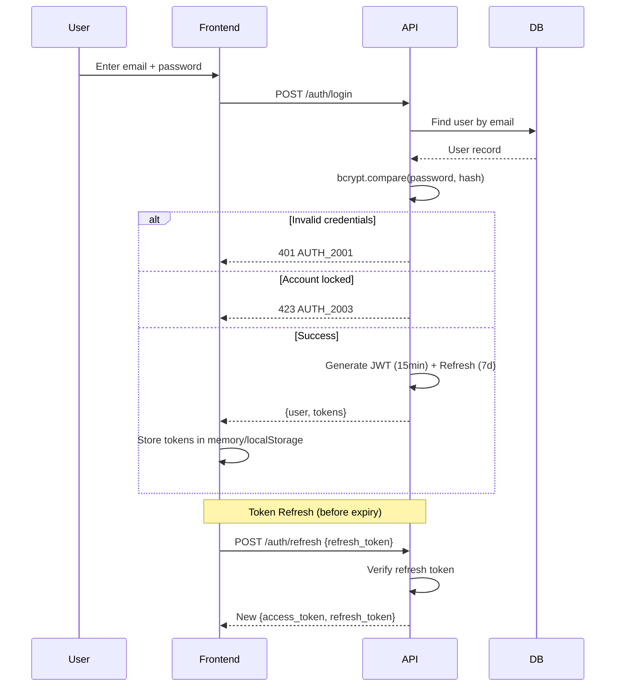

## Guest Management Flow

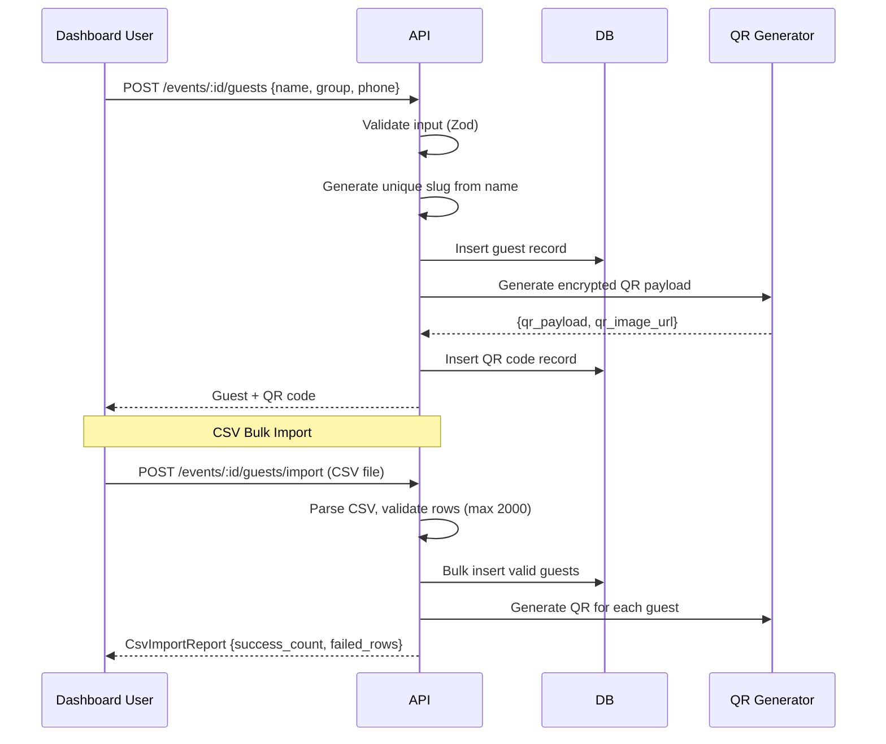

## RSVP Flow

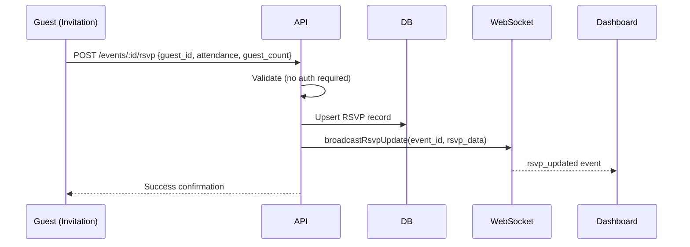

## QR Check-in Flow

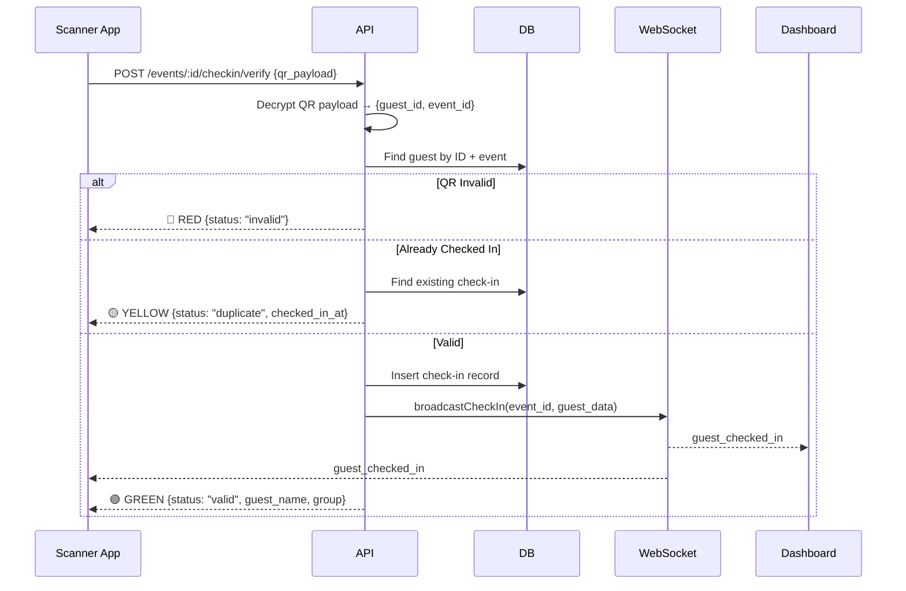

## Offline Check-in Flow (Scanner PWA)

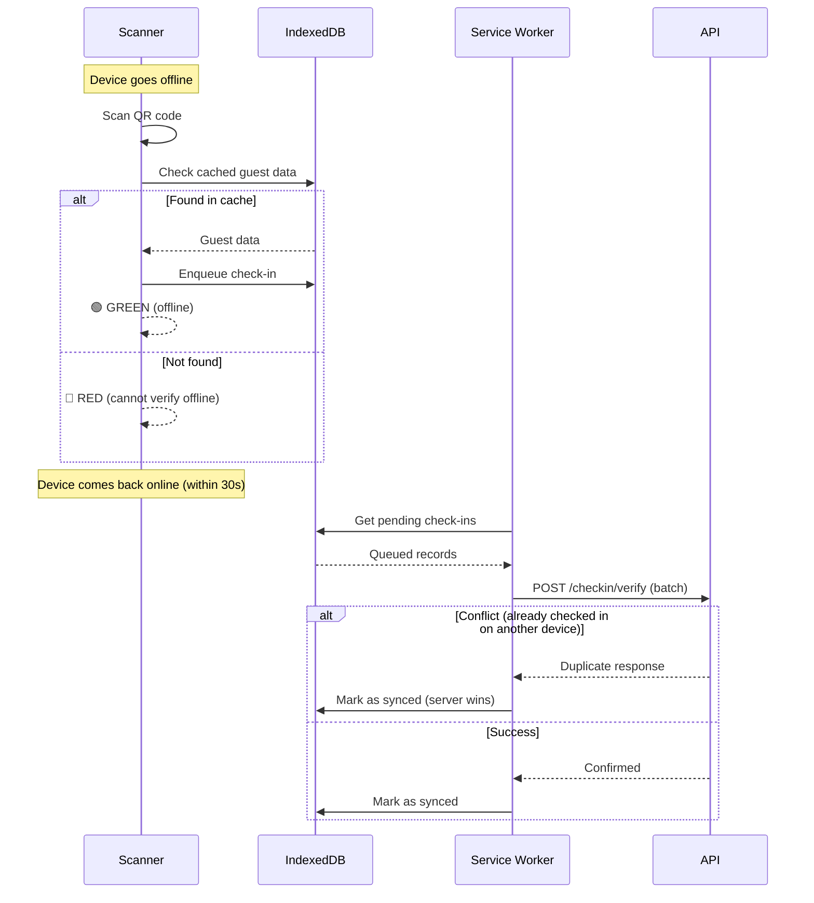

## Go-Show Registration Flow

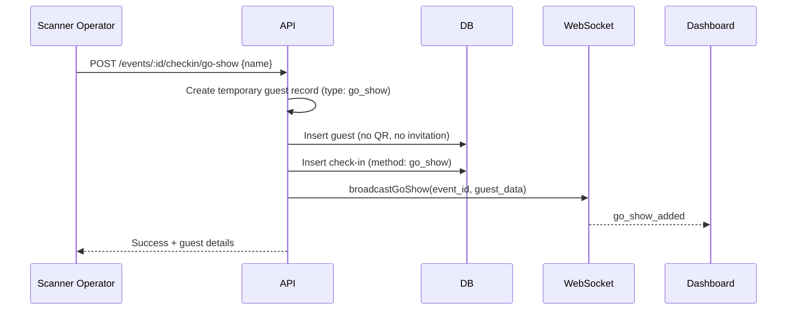

## CMS Section Management Flow

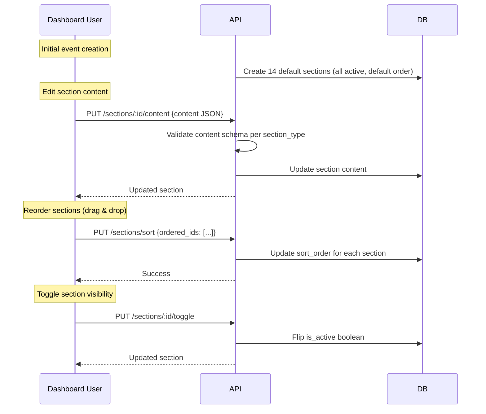

## Invitation Rendering Flow

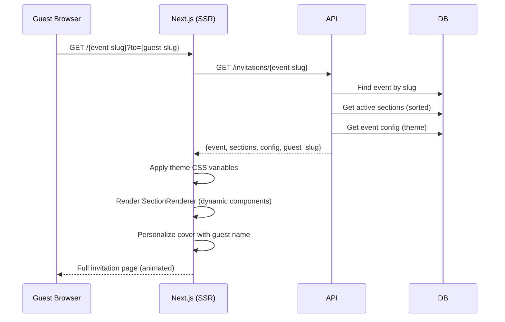

## Notification Sending Flow

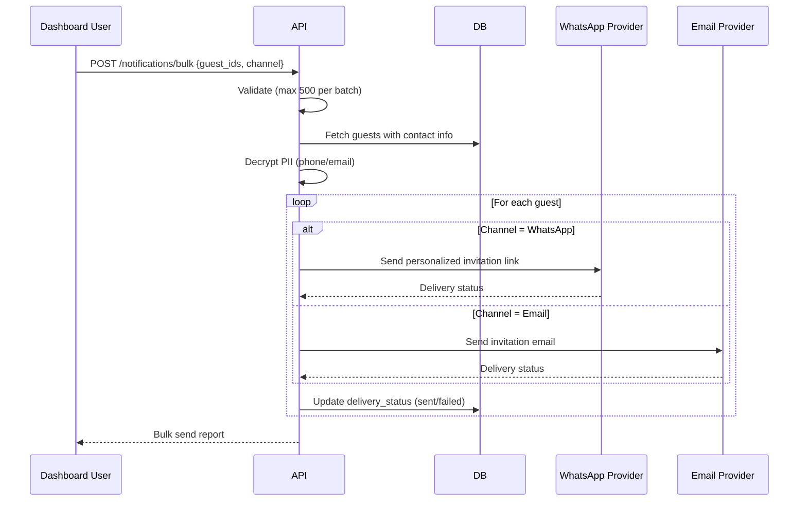

## Deployment Flow

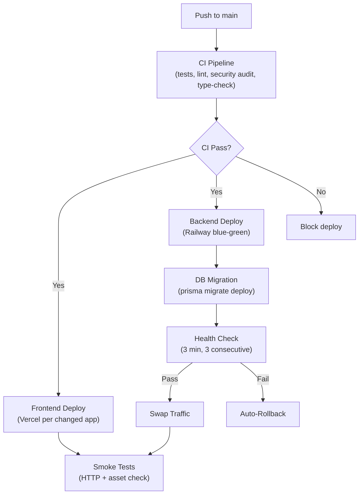

## Scanner Device Registration Flow

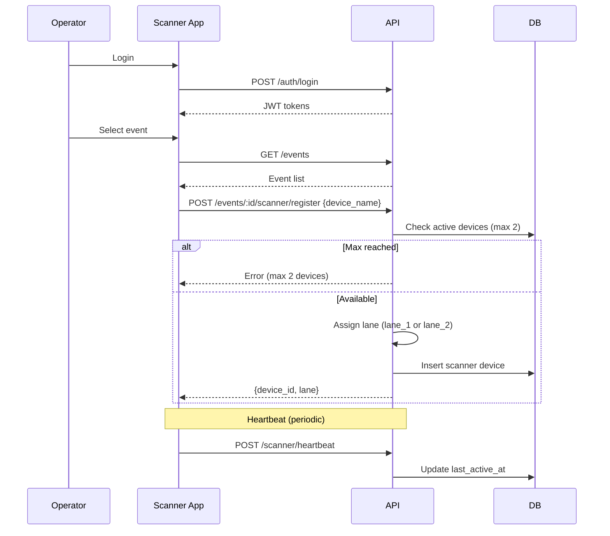

## Real-Time Stats Aggregation

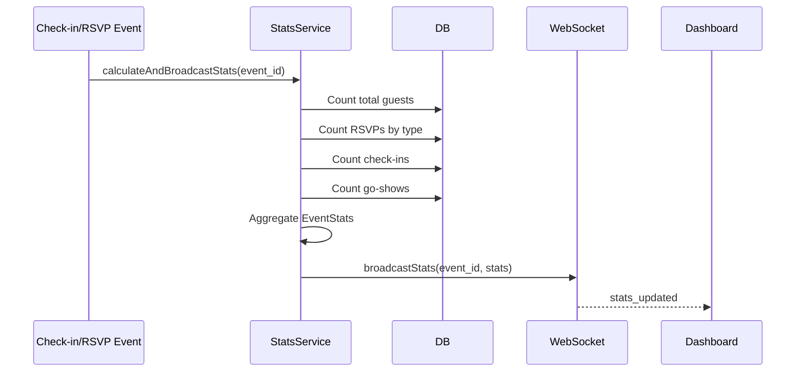
