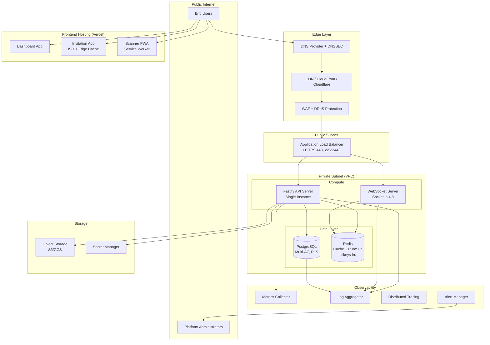
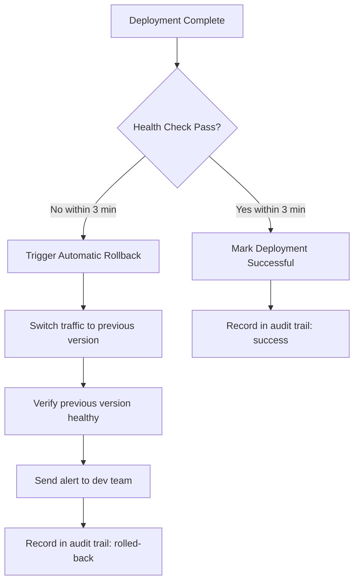

# Design Document: Production Deployment Strategy

## Overview

This design document defines the comprehensive production deployment architecture for the Wedding Digital SaaS platform. It covers the infrastructure topology, security layers, deployment pipelines, observability stack, and disaster recovery strategy required to bring the platform to production readiness.

The platform consists of:

- **3 Frontend Applications**: Dashboard (Next.js 16, responsive), Invitation (Next.js 16, mobile-first), Scanner (Next.js 16, PWA)
- **Backend Services**: Fastify 5 API, PostgreSQL (Prisma 7), Redis (ioredis 5.6), Socket.io 4.8
- **Monorepo Structure**: `apps/` (dashboard, invitation, scanner) and `packages/` (api, db, shared, realtime)

This document is strategic — it serves as a comprehensive guide for the go-live process rather than a directly executable implementation plan.

**Current Scale**: 1 active event, maximum 500 guests. Infrastructure decisions are right-sized for this scale while maintaining security and reliability. The architecture supports future scaling to multiple concurrent events without major redesign.

### Design Decisions & Rationale

| Decision                                         | Rationale                                                                                                                    |
| ------------------------------------------------ | ---------------------------------------------------------------------------------------------------------------------------- |
| VPC with private subnets for backend             | Isolates database and cache from public internet; only load balancer exposed                                                 |
| Single Redis instance (cache + pub/sub)          | At current scale (1 event, ≤500 guests), pub/sub traffic is negligible. Separate when scaling to multiple concurrent events. |
| Blue-green deployment for backend                | Enables instant rollback and zero-downtime releases for stateful services                                                    |
| Rolling updates for frontend (Vercel)            | Vercel handles atomic deployments natively; no custom strategy needed                                                        |
| CDN with origin shield                           | Reduces origin load during cache miss storms (e.g., after deployment cache purge)                                            |
| Managed PostgreSQL with multi-AZ                 | Automatic failover < 60s without application-level changes                                                                   |
| Separate WebSocket subdomain                     | Allows sticky session configuration without affecting stateless API routing                                                  |
| ISR for Invitation App                           | Serves cached pages at edge while allowing 60s revalidation; meets 3G FCP target                                             |
| Single API instance (no clustering/auto-scaling) | 500 guests on 1 event won't saturate a single Fastify process. Add scaling when needed.                                      |

---

## Architecture

### High-Level Infrastructure Topology



````

### Network Security Layers

```mermaid
graph LR
    subgraph "Layer 1: Edge"
        DDoS[DDoS Protection<br/>≥10 Gbps]
        WAF2[WAF<br/>OWASP Top 10]
    end

    subgraph "Layer 2: Transport"
        TLS[TLS 1.2/1.3<br/>HSTS Enabled]
        HTTPS[HTTPS Redirect<br/>301]
    end

    subgraph "Layer 3: Network"
        SG[Security Groups<br/>Port Restrictions]
        VPC2[VPC Isolation<br/>Private Subnets]
    end

    subgraph "Layer 4: Application"
        RateLimit[Rate Limiting]
        Auth[JWT + RBAC]
        RLS2[Row-Level Security]
        Validation[Input Validation<br/>Zod 3.25]
    end

    DDoS --> WAF2 --> TLS --> HTTPS --> SG --> VPC2 --> RateLimit --> Auth --> RLS2 --> Validation
````

### Deployment Flow

```mermaid
sequenceDiagram
    participant Dev as Developer
    participant Git as Git Repository
    participant CI as CI/CD Pipeline
    participant Sec as Security Scan
    participant Approval as Approval Gate
    participant Prod as Production Env
    participant Monitor as Monitoring

    Dev->>Git: Push to main/release branch
    Git->>CI: Trigger pipeline
    CI->>CI: Run unit + integration tests (≥80% coverage)
    CI->>Sec: Dependency vulnerability scan
    CI->>Sec: Static code analysis
    alt Critical/High vulnerability found
        Sec-->>CI: Block deployment
        CI-->>Dev: Notify failure
    else Clean
        Sec-->>CI: Pass
    end
    CI->>Approval: Request manual approval
    Approval-->>CI: Approved by team member
    CI->>CI: Run database migrations
    CI->>Prod: Deploy (blue-green for backend, rolling for frontend)
    Prod->>Monitor: Health check (3 min window)
    alt Health check fails
        Monitor-->>CI: Trigger rollback
        CI->>Prod: Rollback to previous version (<5 min)
        CI-->>Dev: Alert: deployment rolled back
    else Healthy
        Monitor-->>CI: Deployment successful
        CI->>CI: Record audit trail
    end
```

---

## Components and Interfaces

### 1. Frontend Applications (Vercel-hosted)

| Application | Domain                  | Deployment Strategy     | Key Configuration                   |
| ----------- | ----------------------- | ----------------------- | ----------------------------------- |
| Dashboard   | `dashboard.{domain}`    | Rolling update (Vercel) | SSR, React Query hydration          |
| Invitation  | `{event-slug}.{domain}` | Rolling update (Vercel) | ISR (revalidate: 60s), mobile-first |
| Scanner     | `scanner.{domain}`      | Rolling update (Vercel) | PWA, service worker, offline-first  |

**Frontend Security Headers** (applied via Vercel/Next.js middleware):

- `Content-Security-Policy`
- `X-Content-Type-Options: nosniff`
- `X-Frame-Options: DENY`
- `Referrer-Policy: strict-origin-when-cross-origin`
- `Permissions-Policy`
- `Strict-Transport-Security: max-age=31536000; includeSubDomains`

### 2. Backend API Server (Fastify 5)

**Deployment**: Blue-green on compute instances (AWS ECS/GCP Cloud Run)

| Interface    | Endpoint         | Purpose                                              |
| ------------ | ---------------- | ---------------------------------------------------- |
| Health Check | `GET /health`    | Returns PostgreSQL, Redis, WebSocket status (<500ms) |
| REST API     | `api.{domain}/*` | Business logic endpoints                             |
| File Upload  | `POST /upload`   | Signed URL generation for direct-to-S3 upload        |

**Configuration**:

- Single process (no clustering needed for 1 event / ≤500 guests)
- Request body limit: 1MB (JSON), 10MB (file upload)
- Query timeout: 30 seconds
- Request ID (correlation ID) on every request
- Rate limiting per endpoint category:
  - General API: 100 req/min
  - Authentication: 20 req/min
  - Scanner check-in: 300 req/min

### 3. WebSocket Server (Socket.io 4.8)

**Deployment**: Blue-green with graceful shutdown (30s drain)

| Interface | Endpoint            | Purpose                                |
| --------- | ------------------- | -------------------------------------- |
| WebSocket | `wss://ws.{domain}` | Real-time check-in and RSVP broadcasts |

**Configuration**:

- Redis adapter configured (uses shared Redis instance for cache + pub/sub)
- Single instance (sufficient for 1 event / ≤500 guests, ~50 peak concurrent connections)
- Sticky session on load balancer
- Idle timeout: 60s with ping/pong keepalive every 25s
- JWT authentication on handshake
- Room-level authorization (event-scoped)

### 4. PostgreSQL (Managed Service)

| Aspect             | Configuration                                                                                  |
| ------------------ | ---------------------------------------------------------------------------------------------- |
| Availability       | Multi-AZ with automatic failover (RTO < 60s)                                                   |
| Connection Pooling | PgBouncer, min 10 connections (sufficient for 1 event / ≤500 guests)                           |
| Security           | SSL mode `verify-full`, RLS policies on tenant-scoped tables                                   |
| Backup             | Every 6-8 hours + continuous WAL archiving (RPO < 1 hour)                                      |
| Monitoring         | Slow queries (>1s), connection pool utilization, disk usage                                    |
| Indexes            | `tenant_id`, `event_id`, `guest_id`, `qr_payload`, `guest_slug`, `event_slug`, `checked_in_at` |

### 5. Redis (Managed Service — Single Instance)

Single Upstash Redis instance handles both cache and pub/sub at current scale (1 event, ≤500 guests).

| Purpose                                 | Configuration                                |
| --------------------------------------- | -------------------------------------------- |
| Session, rate limits, response cache    | `allkeys-lru`, platform-managed persistence  |
| Socket.io adapter, real-time broadcasts | Shared instance (pub/sub traffic negligible) |

**Configuration**:

- Connection timeout: 5s
- Retry: exponential backoff, max 3 retries
- Graceful degradation on connection failure
- TLS enabled (Upstash `rediss://` endpoint)
- Separation threshold: Consider dedicated pub/sub instance when scaling to multiple concurrent events or 1000+ guests

### 6. Object Storage (S3/GCS)

| Aspect     | Configuration                                              |
| ---------- | ---------------------------------------------------------- |
| Buckets    | Single production bucket                                   |
| Encryption | Server-side encryption (SSE) with managed keys             |
| Access     | No public access; CDN via Origin Access Identity           |
| Upload     | Signed URLs (15min expiry) for direct upload               |
| Lifecycle  | Move to Infrequent Access after 90 days                    |
| Versioning | Enabled for accidental deletion recovery                   |
| Quota      | 5GB per tenant                                             |
| CORS       | Upload from Dashboard domain only; download via CDN domain |

### 7. CDN (CloudFront/Cloudflare)

| Aspect             | Configuration                                       |
| ------------------ | --------------------------------------------------- |
| Edge Locations     | Indonesia-focused (Singapore, Jakarta PoPs)         |
| Caching            | Immutable assets: 1 year; HTML/API: 60s or no-cache |
| Compression        | Brotli (primary) + Gzip (fallback)                  |
| Image Optimization | WebP conversion, responsive sizing                  |
| Origin Shield      | Enabled to reduce origin load on cache miss         |
| Cache Invalidation | Path-specific purge on deployment (not full purge)  |
| Bundle Target      | Invitation App JS+CSS ≤ 200KB gzipped               |

### 8. Secret Manager

| Secret Category                 | Rotation Interval          | Access                                           |
| ------------------------------- | -------------------------- | ------------------------------------------------ |
| Database credentials            | 90 days                    | API server service account only                  |
| JWT signing key                 | 30 days (24h grace period) | API server service account only                  |
| Redis password                  | 90 days                    | API + WebSocket service accounts                 |
| AES-256 encryption key (QR/PII) | Manual rotation            | API server service account only (separate store) |
| API keys (third-party)          | Per provider policy        | Relevant service account only                    |

---

## Data Models

This feature does not introduce new application data models. The relevant infrastructure-level data structures are:

### Deployment Audit Record

```typescript
interface DeploymentAuditRecord {
  id: string;
  timestamp: string; // ISO 8601
  triggeredBy: string; // user identifier
  application: 'dashboard' | 'invitation' | 'scanner' | 'api' | 'websocket';
  commitHash: string;
  previousVersion: string;
  newVersion: string;
  status: 'success' | 'failed' | 'rolled-back';
  rollbackReason?: string;
  duration: number; // seconds
  approvedBy: string;
}
```

### Health Check Response

```typescript
interface HealthCheckResponse {
  status: 'healthy' | 'degraded' | 'unhealthy';
  timestamp: string;
  version: string;
  uptime: number; // seconds
  dependencies: {
    postgresql: { status: 'up' | 'down'; latency: number };
    redis_cache: { status: 'up' | 'down'; latency: number };
    redis_pubsub: { status: 'up' | 'down'; latency: number };
    websocket: { status: 'up' | 'down'; latency: number };
  };
}
```

### Alert Rule Configuration

```typescript
interface AlertRule {
  id: string;
  name: string;
  metric: string;
  condition: 'gt' | 'lt' | 'eq';
  threshold: number;
  duration: string; // e.g., "5m"
  severity: 'critical' | 'warning' | 'info';
  channels: ('email' | 'slack' | 'telegram')[];
}
```

### Backup Manifest

```typescript
interface BackupManifest {
  id: string;
  timestamp: string;
  type: 'daily' | 'weekly' | 'monthly';
  components: {
    postgresql: { location: string; sizeBytes: number; walPosition: string };
    redis: { location: string; sizeBytes: number };
    secrets: { version: string };
    objectStorage: { replicaRegion: string; objectCount: number };
  };
  encrypted: boolean;
  encryptionKeyId: string;
  retentionExpiry: string;
}
```

---

## Error Handling

### Infrastructure-Level Error Handling

| Failure Scenario                | Detection                      | Response                            | Recovery                       |
| ------------------------------- | ------------------------------ | ----------------------------------- | ------------------------------ |
| Database failover               | Health check, connection error | Auto-switch to replica              | Automatic (< 60s RTO)          |
| Redis connection failure        | Connection timeout (5s)        | Graceful degradation (bypass cache) | Retry with exponential backoff |
| WebSocket instance crash        | Health check (10s interval)    | Restart instance                    | Automatic restart              |
| Deployment health check failure | 3-min post-deploy monitoring   | Automatic rollback (< 5 min)        | Previous version restored      |
| SSL certificate renewal failure | Renewal monitoring             | Alert to administrator              | Manual intervention            |
| Secret rotation failure         | Rotation job monitoring        | Alert + retain current secret       | Manual rotation                |
| Disk usage > 80%                | Metric threshold alert         | Alert + auto-expand (if available)  | Storage scaling                |
| DDoS attack                     | WAF + traffic analysis         | Block + rate limit                  | Automatic mitigation           |
| DNS primary failure             | DNS health check (30s)         | Failover to secondary endpoint      | Automatic DNS failover         |
| Object storage quota exceeded   | Upload validation              | Reject upload + notify tenant       | Tenant contacts support        |

### Application-Level Error Handling

| Scenario                         | Behavior                                           |
| -------------------------------- | -------------------------------------------------- |
| API error rate > 5% (5 min)      | Alert via email + Slack/Telegram within 1 min      |
| Response time p95 > 2s (5 min)   | Alert + investigate root cause                     |
| Connection pool > 80%            | Alert + consider pool size increase                |
| WAF block detected               | Log to security log + continue serving             |
| Rate limit exceeded              | Return 429 with retry-after header                 |
| Invalid Content-Type             | Return 415 Unsupported Media Type                  |
| Health check dependency down     | Return HTTP 503 with failing component detail      |
| WebSocket disconnect (Scanner)   | Client reconnect: exponential backoff (1s→30s max) |
| WebSocket disconnect (Dashboard) | Show "reconnecting" indicator                      |

### Rollback Strategy



---

## Testing Strategy

### Why Property-Based Testing Does NOT Apply

This feature covers infrastructure configuration, deployment pipelines, network security, and operational procedures. These are:

1. **Infrastructure as Code** — VPC, security groups, WAF rules, CDN configuration are declarative configurations, not functions with inputs/outputs
2. **External service behavior** — Testing AWS/GCP service responses, DNS propagation, SSL certificate validity
3. **One-shot operations** — Deployment, backup, secret rotation are side-effect-only operations
4. **Configuration validation** — Checking that environment variables, ports, and policies are correctly set

None of these have meaningful "for all inputs X, property P(X) holds" statements. The appropriate testing strategies are:

### Recommended Testing Approach

#### 1. Infrastructure Validation Tests (Smoke Tests)

Verify that infrastructure is correctly configured after provisioning:

- VPC subnet isolation (private subnets not publicly accessible)
- Security group rules match specification (ports 443, 5432, 6379)
- SSL certificates installed and valid on all domains
- DNS records resolve correctly
- WAF rules active and blocking test attack patterns
- Secret Manager accessible by correct service accounts only
- Database RLS policies enforced

#### 2. Integration Tests

Verify component interactions work correctly:

- Load balancer routes to healthy backend instances
- API server connects to PostgreSQL with SSL `verify-full`
- API server connects to Redis with TLS
- WebSocket server connects to Redis pub/sub adapter
- CDN serves assets from correct origin with proper cache headers
- Signed URL upload flow works end-to-end
- Health check endpoint returns correct dependency status

#### 3. Deployment Pipeline Tests

Verify CI/CD pipeline behavior:

- Pipeline blocks on critical/high vulnerabilities
- Pipeline blocks without manual approval
- Rollback triggers within 5 minutes on health check failure
- Database migration runs before application deployment
- Audit trail records all deployment metadata
- Secret scanning blocks commits with exposed credentials

#### 4. Disaster Recovery Tests (Quarterly Drill)

Verify recovery procedures:

- Database point-in-time recovery to specific timestamp
- Full system restore within 4-hour RTO
- Data loss within 1-hour RPO
- DNS failover activates within 30 seconds
- Backup encryption/decryption works correctly
- Runbook procedures are accurate and complete

#### 5. Security Tests

Verify security hardening:

- Penetration testing against OWASP Top 10
- Rate limiting enforcement per endpoint category
- CORS policy rejects unauthorized origins
- Security headers present on all responses
- No server information leaked in headers
- Parameterized queries prevent SQL injection
- Output sanitization prevents stored XSS

#### 6. Performance Tests

Verify performance targets under load:

- API response time p95 < 2s under expected load
- Invitation App FCP < 3s on simulated 3G
- WebSocket broadcast latency < 500ms
- QR scan verification < 2s
- Database lookup < 100ms

### Test Execution Schedule

| Test Type         | Frequency              | Trigger                        |
| ----------------- | ---------------------- | ------------------------------ |
| Smoke tests       | Every deployment       | Post-deploy pipeline step      |
| Integration tests | Every deployment       | CI/CD pipeline                 |
| Security scan     | Daily (automated)      | Scheduled job                  |
| Performance tests | Weekly + pre-release   | Scheduled + manual             |
| DR drill          | Quarterly              | Manual with documented runbook |
| Penetration test  | Pre-launch + quarterly | Manual by security team        |

---

## MCP Integration for Development & Deployment

All infrastructure management tasks MUST leverage the installed MCP (Model Context Protocol) servers when interacting with the corresponding platforms. This ensures consistent, auditable, and efficient operations directly from the development environment.

### Available MCP Servers

| MCP Server                   | Platform                | Location                             | Capabilities                                                             |
| ---------------------------- | ----------------------- | ------------------------------------ | ------------------------------------------------------------------------ |
| **Supabase** (Power)         | PostgreSQL Database     | `~/.kiro/settings/mcp.json` (powers) | Create tables, manage RLS policies, run migrations, manage auth, storage |
| **Upstash**                  | Redis (Cache + Pub/Sub) | `~/.kiro/settings/mcp.json`          | Create/manage Redis databases, run commands, backups, statistics         |
| **Cloudflare Bindings**      | R2 Storage, Workers, KV | `~/.kiro/settings/mcp.json`          | Manage R2 buckets, Workers deployments, KV namespaces                    |
| **Cloudflare Observability** | Logs & Analytics        | `~/.kiro/settings/mcp.json`          | Debug logs, analytics, performance insights                              |
| **GitHub**                   | Repository & CI/CD      | `~/.kiro/settings/mcp.json`          | Manage repos, PRs, issues, Actions workflows                             |

### MCP Usage Rules

1. **Database operations** (schema changes, RLS policies, migrations, queries) → Use **Supabase MCP**
2. **Redis operations** (create database, run commands, check stats, manage backups) → Use **Upstash MCP**
3. **Object storage** (create R2 buckets, configure CORS, manage lifecycle rules) → Use **Cloudflare Bindings MCP**
4. **Monitoring & debugging** (check logs, analytics, performance) → Use **Cloudflare Observability MCP**
5. **Repository management** (create PRs, manage issues, check Actions) → Use **GitHub MCP**
6. **Frontend deployment** (Vercel) → Use Git push (auto-deploy via GitHub integration) or Vercel CLI
7. **Backend deployment** (Railway) → Use Git push (auto-deploy via GitHub integration) or Railway CLI

### MCP-First Workflow

When implementing tasks that involve these platforms, the agent MUST:

1. **Check if an MCP server exists** for the target platform before using CLI or manual configuration
2. **Prefer MCP tools** over terminal commands for supported operations (e.g., use Supabase MCP to create tables instead of running raw SQL via psql)
3. **Fall back to CLI/terminal** only when the MCP server does not support the specific operation needed
4. **Never hardcode credentials** in project files — all secrets are managed via MCP server configurations in user-level settings (`~/.kiro/settings/mcp.json`)

### Platform-to-MCP Mapping for Deployment Tasks

| Deployment Task            | MCP to Use                                  | Fallback             |
| -------------------------- | ------------------------------------------- | -------------------- |
| Create PostgreSQL database | Supabase MCP                                | Supabase Dashboard   |
| Setup RLS policies         | Supabase MCP                                | SQL migration files  |
| Run database migrations    | Supabase MCP or `npx prisma migrate deploy` | Terminal             |
| Create Redis database      | Upstash MCP                                 | Upstash Console      |
| Run Redis commands         | Upstash MCP                                 | Terminal (redis-cli) |
| Check Redis statistics     | Upstash MCP                                 | Upstash Console      |
| Create R2 bucket           | Cloudflare Bindings MCP                     | Cloudflare Dashboard |
| Configure R2 CORS          | Cloudflare Bindings MCP                     | Cloudflare Dashboard |
| Check application logs     | Cloudflare Observability MCP                | Cloudflare Dashboard |
| Create GitHub PR           | GitHub MCP                                  | `gh` CLI             |
| Manage GitHub Actions      | GitHub MCP                                  | GitHub web UI        |
| Deploy frontend            | Git push → Vercel auto-deploy               | `npx vercel` CLI     |
| Deploy backend             | Git push → Railway auto-deploy              | `railway` CLI        |
