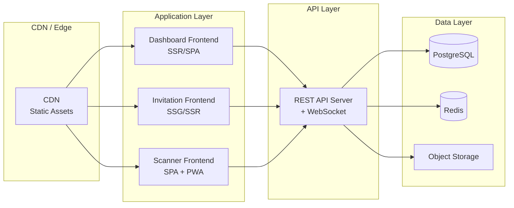
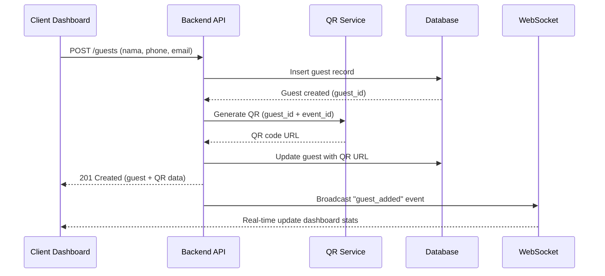
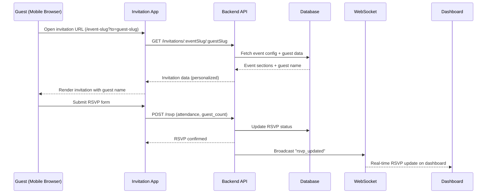
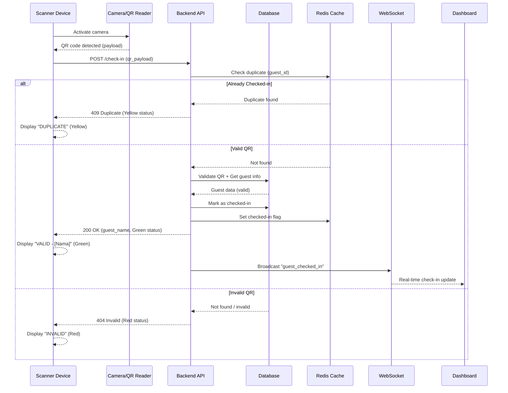
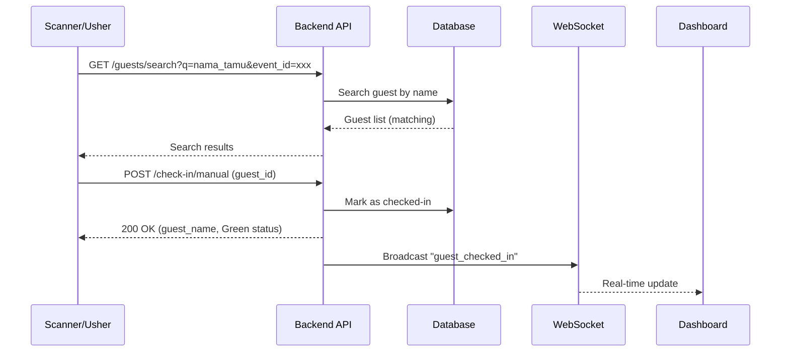
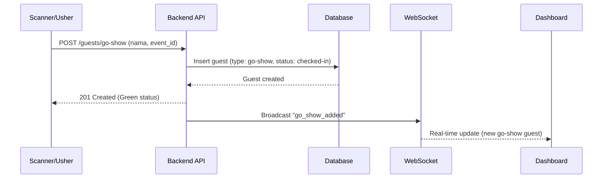
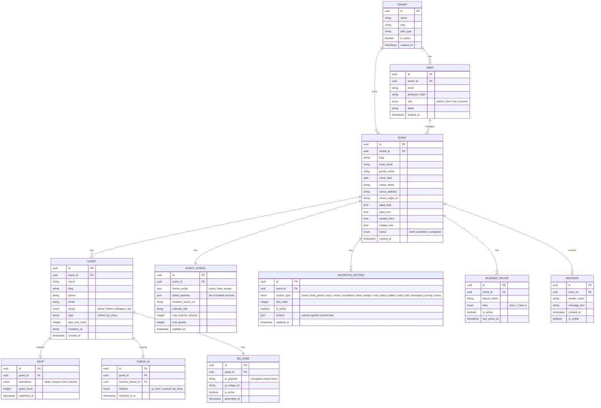

# Design Document: Wedding Digital SaaS Ecosystem

## Overview

Wedding Digital SaaS adalah platform multi-tenant yang menyediakan ekosistem lengkap untuk manajemen undangan pernikahan digital. Platform ini terdiri dari 3 aplikasi utama yang saling terintegrasi: (1) Client & WO Dashboard untuk mengelola tamu dan konten undangan, (2) Wedding Invitation sebagai web app undangan yang dilihat tamu, dan (3) Scanner System untuk verifikasi kehadiran tamu di hari-H.

Ketiga aplikasi berbagi satu backend dan database yang sama, dengan real-time synchronization antara scanner dan dashboard. Sistem dirancang untuk mendukung banyak client (multi-tenant) dimana setiap client memiliki event pernikahan masing-masing dengan data yang terisolasi. Desain mengutamakan performa scanning di bawah 2 detik dan pengalaman mobile-first untuk undangan tamu.

Platform ini dibangun dengan pendekatan modular dimana setiap section undangan dapat diaktifkan/dinonaktifkan sesuai paket yang dipilih client, memberikan fleksibilitas bisnis model SaaS.

## Architecture

### System Architecture Overview

```mermaid
graph TD
    subgraph "Client Applications"
        A[Client & WO Dashboard<br/>Responsive Web App]
        B[Wedding Invitation<br/>Mobile-First Web App]
        C[Scanner System<br/>Mobile-Optimized Web App]
    end

    subgraph "Backend Services"
        D[API Gateway / Load Balancer]
        E[Auth Service]
        F[Event Management Service]
        G[Guest Management Service]
        H[QR Code Service]
        I[CMS Service]
        J[Scanner & Check-in Service]
        K[Real-time Sync Service<br/>WebSocket Server]
    end

    subgraph "Data Layer"
        L[(Primary Database<br/>PostgreSQL)]
        M[(Cache Layer<br/>Redis)]
        N[File Storage<br/>Cloud Storage / S3]
    end

    subgraph "External Services"
        O[QR Code Generator]
        P[Email/WhatsApp Notification]
    end

    A --> D
    B --> D
    C --> D

    D --> E
    D --> F
    D --> G
    D --> H
    D --> I
    D --> J

    A <--> K
    C <--> K

    E --> L
    F --> L
    G --> L
    H --> L
    I --> L
    J --> L

    G --> M
    J --> M
    K --> M

    I --> N
    H --> O
    G --> P
end
```

### Deployment Architecture



## Components and Interfaces

### Component 1: Client & WO Dashboard (App 1 - Tahap 1)

**Purpose**: Aplikasi web responsif untuk client dan Wedding Organizer mengelola seluruh aspek undangan digital — mulai dari manajemen tamu, tracking RSVP, hingga pengaturan konten undangan melalui CMS.

**Sub-Components**:

| Sub-Component | Tanggung Jawab |
|---|---|
| Guest Management Module | CRUD tamu, import bulk, assign QR code otomatis |
| RSVP Tracking Dashboard | Real-time monitoring konfirmasi kehadiran |
| QR Code Generator | Generate unique QR per tamu secara otomatis saat tamu ditambahkan |
| CMS Editor | Kelola konten setiap section undangan (All-In) |
| Analytics Dashboard | Statistik tamu, RSVP rate, check-in rate |
| Theme & Settings | Konfigurasi tema, warna, dan pengaturan event |

**Responsibilities**:
- Autentikasi dan otorisasi client/WO
- Manajemen data tamu (tambah, edit, hapus, import CSV)
- Auto-generate QR code unik saat tamu baru ditambahkan
- Real-time dashboard tracking RSVP dan check-in
- CMS lengkap untuk mengisi konten undangan per section
- Preview undangan sebelum publish
- Responsive design (desktop & mobile friendly)

---

### Component 2: Wedding Invitation (App 2 - Tahap 2)

**Purpose**: Web application undangan digital yang dilihat oleh tamu, mengutamakan tampilan mobile browser. Setiap tamu mendapat URL unik dengan nama mereka yang ter-personalisasi.

**Sub-Components (Sections berdasarkan referensi)**:

| Section | Deskripsi |
|---|---|
| Cover / Opening | Animasi loading, nama mempelai, tombol "Lihat Undangan" dengan nama tamu |
| Pengantin (Bride & Groom) | Ilustrasi dan info kedua mempelai |
| Our Story | Timeline cerita perjalanan cinta (chapters) |
| Doa / Ayat | Kutipan ayat suci atau doa |
| Bride & Groom Detail | Nama lengkap, orang tua, link Instagram |
| Countdown | Hitung mundur ke hari-H + tombol "Tambah ke Kalender" |
| Akad & Resepsi | Detail waktu, tempat, dan link Google Maps |
| Konfirmasi Kehadiran (RSVP) | Form konfirmasi: nama, pilihan acara, jumlah tamu |
| Attire / Dress Code | Panduan pakaian dan color palette |
| Photo Gallery | Galeri foto prewedding dengan carousel/lightbox |
| Video | Video prewedding atau cinematic |
| Wedding Gift | Info rekening/transfer untuk kado digital |
| Pesan & Ucapan | Form kirim ucapan + tampilan ucapan dari tamu lain |
| Penutup / Closing | Foto penutup dan terima kasih |
| Background Music | Audio player dengan kontrol play/pause |

**Responsibilities**:
- Render undangan berdasarkan slug event + guest ID
- Personalisasi nama tamu di cover
- Menampilkan section sesuai konfigurasi CMS (modul aktif/nonaktif)
- Form RSVP yang terhubung ke backend
- Optimasi performa mobile (lazy loading, image optimization)
- Animasi scroll dan transisi antar section
- SEO-friendly dan shareable via WhatsApp/social media

---

### Component 3: Scanner System (App 3 - Tahap 3)

**Purpose**: Aplikasi web mobile-optimized untuk verifikasi kehadiran tamu di venue menggunakan QR code scanner, dengan fallback manual check-in dan dukungan multi-device.

**Sub-Components**:

| Sub-Component | Deskripsi |
|---|---|
| QR Scanner Camera | Komponen kamera untuk scan QR code (< 2 detik) |
| Usher Screen | Tampilan status verifikasi: Valid (Hijau), Invalid (Merah), Duplicate (Kuning) |
| Guest Info Display | Menampilkan nama tamu saat verifikasi berhasil |
| Manual Check-in | Search bar untuk cari tamu manual + tombol check-in |
| Go-Show Registration | Form tambah tamu walk-in yang belum terdaftar |
| Queue Lane Settings | Konfigurasi jalur antrian (hingga 2 scanner device) |
| Real-time Sync | Sinkronisasi data check-in ke dashboard secara real-time |

**Responsibilities**:
- Scan QR code dengan response time < 2 detik
- Tampilkan status verifikasi dengan color-coded feedback
- Tampilkan nama tamu saat scan berhasil
- Fallback: manual search + check-in jika tamu tidak bawa QR
- Registrasi tamu Go-Show (walk-in)
- Support hingga 2 scanner device bersamaan per event
- Real-time sync ke dashboard via WebSocket
- Offline-capable (PWA) untuk antisipasi koneksi tidak stabil

---

### Component 4: Backend API Services

**Purpose**: Shared backend yang melayani ketiga aplikasi frontend dengan arsitektur modular service-based.

**Sub-Components**:

| Service | Tanggung Jawab |
|---|---|
| Auth Service | Login, register, JWT token, role-based access (Admin, Client, WO, Scanner) |
| Event Service | CRUD event pernikahan, konfigurasi event |
| Guest Service | CRUD tamu, bulk import, assign QR, RSVP processing |
| QR Service | Generate QR code unik, validasi QR saat scan |
| CMS Service | CRUD konten per section, upload media, template management |
| Check-in Service | Proses check-in, validasi duplikat, Go-Show registration |
| Real-time Service | WebSocket server untuk push update ke dashboard & scanner |
| Notification Service | Kirim undangan via WhatsApp/Email dengan link personalisasi |

---

### Component 5: Real-time Sync Service

**Purpose**: Menjamin sinkronisasi data real-time antara Scanner System dan Dashboard menggunakan WebSocket.

**Responsibilities**:
- Broadcast event check-in ke semua connected dashboard clients
- Broadcast RSVP update ke dashboard
- Manage WebSocket connections per event (room-based)
- Handle reconnection dan message queuing saat koneksi terputus
- Support multiple scanner devices per event room

## Sequence Diagrams

### Flow 1: Client Menambah Tamu Baru (Auto QR Generation)



### Flow 2: Tamu Membuka Undangan & RSVP



### Flow 3: Scanner Check-in di Venue



### Flow 4: Manual Check-in (Fallback)



### Flow 5: Go-Show Guest Registration



## Data Models

### Entity Relationship Diagram



### Model Detail: INVITATION_SECTION Content JSON

Setiap section memiliki struktur `content` JSON yang berbeda sesuai tipe:

| Section Type | Content Structure |
|---|---|
| `cover` | `{ title, subtitle, background_image, opening_text }` |
| `bride_groom` | `{ bride: { name, parent_info, photo, instagram }, groom: { ... } }` |
| `story` | `{ chapters: [{ title, description, image, date }] }` |
| `verse` | `{ text, source, background_image }` |
| `countdown` | `{ target_date, calendar_link }` |
| `akad_resepsi` | `{ akad: { date, time_start, time_end }, resepsi: { ... }, venue, maps_url }` |
| `rsvp` | `{ options: ["akad", "resepsi", "both", "decline"], max_plus_one }` |
| `attire` | `{ description, outfit_image, color_palette: [hex_colors] }` |
| `gallery` | `{ photos: [{ url, caption, order }] }` |
| `video` | `{ video_url, thumbnail_url, type: "youtube|upload" }` |
| `gift` | `{ accounts: [{ bank, account_number, account_name }], description }` |
| `messages` | `{ is_enabled, placeholder_text }` |
| `closing` | `{ text, image, thank_you_message }` |
| `music` | `{ audio_url, autoplay, title }` |

### Model Detail: Theme Configuration

```
EVENT_CONFIG.theme_config = {
  // Dashboard Theme
  // Default palette dari: https://colorhunt.co/palette/a8bba3f7f4eaebd9d1b87c4c
  // Tema dashboard bersifat DINAMIS — client bisa mengganti palette kapan saja.
  // Referensi eksplorasi warna: https://colorhunt.co
  dashboard: {
    primary_color: "#A8BBA3",      // Sage Green
    secondary_color: "#F7F4EA",    // Cream / Off-white
    accent_color: "#B87C4C",       // Warm Brown / Copper
    surface_color: "#EBD9D1",      // Blush / Dusty Pink (cards, panels)
    text_color: "#2D3436",         // Dark charcoal
    font_family: "Poppins",        // Body text
    font_heading: "Playfair Display" // Headings
  },
  
  // Invitation Theme (terpisah dari dashboard)
  // Default: Classic Sage & Gold (Option A)
  // Client bisa mengkustomisasi melalui CMS Dashboard
  invitation: {
    primary_color: "#5F7161",      // Sage Green (deeper)
    secondary_color: "#A7C4A0",    // Light Sage
    accent_color: "#C9A96E",       // Gold
    background_color: "#FDFCF9",   // Warm White
    text_color: "#2D3436",         // Dark charcoal
    font_family: "Poppins",        // Body text
    font_heading: "Playfair Display", // Headings
    template_id: "classic-sage-gold"
  }
}
```

**Catatan Penting:**
- Dashboard theme bersifat **dinamis** — client dapat mengganti color palette kapan saja melalui menu Theme & Settings.
- Saat client ingin eksplorasi warna baru, sistem menyediakan link referensi ke [ColorHunt](https://colorhunt.co) sebagai inspirasi palette.
- Font **Playfair Display** (heading) + **Poppins** (body) digunakan konsisten di kedua aplikasi (Dashboard & Invitation).
- Invitation theme bisa di-override per event melalui CMS Editor.

## Error Handling

### Error Scenario 1: QR Code Scan - Invalid QR

**Condition**: QR code tidak ditemukan di database, sudah expired/deactivated, atau memiliki format valid tetapi gagal validasi event-specific (misalnya milik event lain)
**Response**: Scanner menampilkan layar MERAH dengan pesan "QR Tidak Valid"
**Recovery**: Usher menggunakan Manual Check-in (search bar) untuk mencari tamu

### Error Scenario 2: QR Code Scan - Duplicate Check-in

**Condition**: Tamu sudah pernah di-check-in sebelumnya (terdeteksi via Redis cache)
**Response**: Scanner menampilkan layar KUNING dengan pesan "Sudah Check-in" + nama tamu
**Recovery**: Usher memverifikasi secara manual, tidak perlu action tambahan

### Error Scenario 3: WebSocket Connection Lost

**Condition**: Koneksi internet terputus antara scanner dan server
**Response**: Scanner tetap bisa beroperasi dengan mode offline (PWA cache). Jika local storage mencapai 2000 record, scanner tetap mengizinkan scanning dengan overflow handling (menimpa record tertua yang sudah tersinkronisasi atau menampilkan peringatan) tanpa menghentikan operasi.
**Recovery**: Saat konektivitas terdeteksi (baik melalui event pemulihan koneksi maupun deteksi konektivitas periodik), data check-in yang tertunda di-sync otomatis dalam waktu tidak lebih dari 30 detik

### Error Scenario 4: Multiple Scanner Conflict

**Condition**: Dua scanner device scan QR yang sama hampir bersamaan
**Response**: Redis atomic operation memastikan hanya satu yang berhasil, yang kedua mendapat "Duplicate"
**Recovery**: Tidak perlu action — race condition ditangani di level cache

### Error Scenario 5: Guest Not Found (Manual Search)

**Condition**: Nama tamu tidak ditemukan saat manual search
**Response**: Tampilkan opsi "Tambah sebagai Go-Show"
**Recovery**: Usher bisa mendaftarkan tamu sebagai Go-Show guest

### Error Scenario 6: CMS Media Upload Failure

**Condition**: Upload foto/video gagal (file terlalu besar atau format tidak didukung)
**Response**: Tampilkan error message dengan batasan yang jelas (max size, format yang didukung)
**Recovery**: Client bisa compress/convert file dan upload ulang

## Testing Strategy

### Unit Testing Approach

- Test setiap service secara independen (Auth, Guest, QR, Check-in, CMS)
- Mock database dan external services
- Coverage target: minimal 80% untuk business logic
- Focus area: QR validation logic, RSVP processing, duplicate detection

### Property-Based Testing Approach

**Property Test Library**: fast-check 4.2 (untuk TypeScript/JavaScript ecosystem)
**Test Runner**: Vitest 3.2

**Key Properties**:
- QR code uniqueness: Untuk setiap N guest yang di-generate QR, semua QR payload harus unik
- Check-in idempotency: Check-in yang sama berkali-kali hanya menghasilkan 1 record
- RSVP consistency: Guest count pada RSVP tidak boleh melebihi max_plus_one + 1
- Multi-tenant isolation: Query untuk tenant A tidak pernah mengembalikan data tenant B
- Section ordering: Sort order pada invitation sections selalu menghasilkan urutan yang konsisten

### Integration Testing Approach

- Test end-to-end flow: tambah tamu → generate QR → scan QR → check-in
- Test WebSocket real-time sync antara scanner dan dashboard
- Test concurrent scanner operations (2 devices)
- Load testing: simulasi 500+ tamu dengan 2 scanner bersamaan
- Test offline/online transition pada Scanner PWA

## Performance Considerations

| Aspek | Target | Strategi |
|---|---|---|
| QR Scan Response | < 2 detik | Redis cache untuk lookup, indexed QR payload |
| Invitation Load Time | < 3 detik (mobile 3G) | SSG/SSR, lazy loading images, CDN |
| Dashboard Real-time | < 500ms latency | WebSocket + Redis pub/sub |
| Concurrent Scanners | 0-2 devices simultan, max 20% overhead (min baseline 50ms) | Atomic Redis operations, optimistic locking |
| Guest Capacity | 500-2000 per event | Pagination, efficient queries, caching |
| Media Storage | Unlimited photos/video | Cloud storage + CDN, image optimization |

### Caching Strategy

- **Redis**: Check-in status (fast duplicate detection), session data, real-time counters
- **CDN**: Static assets undangan (images, fonts, CSS/JS)
- **Browser Cache**: PWA service worker untuk Scanner offline capability
- **Database Index**: QR payload, guest slug, event slug untuk fast lookup

## Security Considerations

| Aspek | Implementasi |
|---|---|
| Multi-tenant Isolation | Row-level security, tenant_id pada setiap query |
| Authentication | JWT token dengan refresh token rotation |
| Authorization | Role-based: Admin (scoped access), Client, WO, Scanner (scan + manual check-in) |
| QR Code Security | Encrypted payload (AES-256), one-time validation token |
| API Rate Limiting | Per-tenant rate limit untuk mencegah abuse |
| Data Privacy | Encrypt PII (phone, email) at rest |
| CORS | Strict origin policy per application |
| Input Validation | Server-side validation pada semua endpoint |
| File Upload | Virus scan, file type validation, size limits |

### Role-Based Access Control

| Role | Dashboard | CMS | Scanner | Guest Data |
|---|---|---|---|---|
| Admin (Platform) | Scoped Access (same visibility restrictions as other roles) | Scoped Access | Scoped Access | Scoped per assignment |
| Client | Own Event | Own Event | View Only | Own Event |
| WO | Assigned Events | Assigned Events | Full Access | Assigned Events |
| Scanner Operator | - | - | QR Scan + Manual Check-in (both mandatory) | Read Only |

**Catatan**: Admin tidak memiliki akses unrestricted ke semua data. Visibilitas data Admin dibatasi sesuai scope yang di-assign, sama seperti role lainnya.

## Dependencies

### Frontend Dependencies

| Dependency | Version | Purpose | Used By |
|---|---|---|---|
| Next.js | 16.2.0 | Framework utama (React 19.2) | All 3 Apps |
| React / React-DOM | 19.2.0 | UI library | All 3 Apps |
| TailwindCSS | 4.1.7 | Styling & responsive design | All 3 Apps |
| shadcn/ui | latest | Component library (copy-paste, fully customizable) | All 3 Apps |
| Motion (formerly Framer Motion) | 12.17.0 | Animasi scroll undangan | Invitation App |
| html5-qrcode | 2.3.8 | QR code scanning library | Scanner App |
| Socket.io Client | 4.8.3 | WebSocket real-time | Dashboard & Scanner |
| @tanstack/react-query | 5.89.0 | Data fetching & caching | All 3 Apps |
| React Hook Form | 7.62.0 | Form handling (RSVP, CMS) | Dashboard & Invitation |
| Zod | 3.25.3 | Schema validation | All 3 Apps |

### Backend Dependencies

| Dependency | Version | Purpose |
|---|---|---|
| Node.js | 20+ | Runtime |
| Fastify | 5.3.2 | API server |
| PostgreSQL | latest | Primary database |
| Prisma | 7.7.0 | Database ORM |
| ioredis | 5.6.0 | Redis client (caching & pub/sub) |
| Socket.io | 4.8.3 | WebSocket server |
| qrcode (npm) | latest | QR code generation |
| Sharp | 0.34.1 | Image processing & optimization |
| Multer | 1.4.5-lts.2 | File upload handling |
| jsonwebtoken | 9.0.2 | JWT authentication |
| bcrypt | 6.0.0 | Password hashing |
| Zod | 3.25.3 | Input validation |

### Testing Dependencies

| Dependency | Version | Purpose |
|---|---|---|
| Vitest | 3.2.4 | Unit & integration testing |
| fast-check | 4.2.0 | Property-based testing |
| TypeScript | 5.9.3 | Type checking |

### Infrastructure

| Service | Purpose |
|---|---|
| Cloud Hosting (Vercel/AWS/GCP) | Application deployment |
| Cloud Storage (S3/GCS) | Media file storage |
| CDN (CloudFront/Cloudflare) | Static asset delivery |
| Managed PostgreSQL | Database hosting |
| Redis Cloud / ElastiCache | Cache & pub/sub |
| Domain & SSL | HTTPS untuk semua apps |

## Correctness Properties

*A property is a characteristic or behavior that should hold true across all valid executions of a system — essentially, a formal statement about what the system should do. Properties serve as the bridge between human-readable specifications and machine-verifiable correctness guarantees.*

### Property 1: Tenant Data Isolation

*For any* tenant T and any database query Q executed in the context of tenant T, all returned results SHALL only contain records where tenant_id equals T, and any attempt to access resources belonging to a different tenant SHALL be rejected.

**Validates: Requirements 1.2, 1.3**

### Property 2: Event Data Isolation Within Tenant

*For any* two events E1 and E2 within the same tenant, querying guests, check-ins, or RSVP data for event E1 SHALL never return records belonging to event E2.

**Validates: Requirement 1.4**

### Property 3: Role-Based Data Access

*For any* user with a specific role (Admin, Client, WO, Scanner Operator), the system SHALL only return data that the role is authorized to access — Admin sees only scoped data per assignment, Client sees only own events, WO sees only assigned events, Scanner Operator can perform both QR scan and manual check-in operations (both capabilities mandatory).

**Validates: Requirements 2.6, 2.7, 2.8**

### Property 4: QR Code Uniqueness

*For any* N guests added to an event (individually or via bulk import), all generated QR code payloads SHALL be unique — no two guests within the same event or across events SHALL share the same QR payload.

**Validates: Requirements 3.1, 3.3, 3.6**

### Property 5: QR Code Encryption

*For any* generated QR code, the payload SHALL be encrypted using AES-256 such that the raw guest_id and event_id are not readable from the payload without decryption.

**Validates: Requirements 3.5, 13.1**

### Property 6: RSVP Guest Count Validation

*For any* RSVP submission with a guest_count value, the system SHALL accept the submission only if guest_count is less than or equal to (plus_one_count + 1), and SHALL reject submissions that exceed this limit.

**Validates: Requirements 4.3, 4.4**

### Property 7: Active Section Rendering

*For any* event configuration with a set of sections marked active/inactive, the Invitation App SHALL render only the sections marked as active, and the rendered sections SHALL appear in the order defined by sort_order.

**Validates: Requirements 5.3, 6.3**

### Property 8: Section Sort Order Uniqueness

*For any* event with N active sections, all sort_order values SHALL be unique and form a valid sequential ordering without gaps or duplicates.

**Validates: Requirement 5.9**

### Property 9: Invitation Personalization

*For any* guest with a valid invitation URL, opening the URL SHALL render the invitation with the guest's name displayed on the cover section, matching the guest record in the database.

**Validates: Requirements 6.1, 14.2**

### Property 10: Scanner Verification Status Mapping

*For any* QR code scan attempt, the Scanner System SHALL return exactly one of three statuses: GREEN (valid QR, not yet checked-in) with guest name, RED (invalid/not found QR, or valid format but fails event-specific validation such as belonging to a different event), or YELLOW (already checked-in) with guest name — and the status SHALL correctly correspond to the actual state of the QR code and guest record.

**Validates: Requirements 7.2, 7.3, 7.4**

### Property 11: Check-in Idempotency

*For any* guest, regardless of how many check-in attempts are made (via QR scan, manual, or concurrent scanners), the system SHALL maintain exactly one check-in record per guest.

**Validates: Requirements 7.5, 7.7**

### Property 12: Scanner Device Limit

*For any* event, the number of active scanner devices SHALL never exceed the configured max_scanner_devices (default: 2).

**Validates: Requirement 7.6**

### Property 13: Go-Show Guest Tracking

*For any* Go-Show guest registration, the created guest record SHALL have type="go_show" AND the associated check-in record SHALL have method="go_show" AND the guest SHALL be immediately marked as checked-in.

**Validates: Requirements 8.4, 8.5**

### Property 14: WebSocket Room Isolation

*For any* WebSocket event broadcast for event E, only clients connected to event E's room SHALL receive the message — clients connected to other event rooms SHALL not receive it.

**Validates: Requirement 9.3**

### Property 15: Offline Sync Completeness

*For any* set of check-in records stored in the offline queue during connection loss, all records SHALL be successfully synced to the server when connectivity is detected (regardless of whether a restoration event occurred), with no data loss. When local storage reaches capacity (2000 records), the system SHALL continue scanning with overflow handling without stopping operations.

**Validates: Requirements 9.5, 10.2, 10.3**

### Property 16: Real-time Data Consistency

*For any* point in time, the dashboard's displayed total_checked_in count SHALL equal the actual count of check-in records in the database for that event.

**Validates: Requirement 9.7**

### Property 17: PII Encryption at Rest

*For any* guest record containing phone or email data, the stored values in the database SHALL be encrypted using symmetric encryption such that plaintext values are never stored directly in storage.

**Validates: Requirement 13.2**

### Property 18: Server-Side Input Validation

*For any* API request with invalid input (malformed data, missing required fields, out-of-range values, empty fields, or partial/ambiguous inputs), the Backend API SHALL reject the request with an appropriate error response before processing. Ambiguous inputs (such as empty color fields or partial hex values) SHALL be treated as invalid.

**Validates: Requirements 13.5, 13.6**

### Property 19: Cross-Tenant Access Rejection

*For any* request attempting to access resources belonging to a different tenant, the Backend API SHALL return 403 Forbidden regardless of whether the request contains a valid tenant_id or not, without revealing information about the resource's existence.

**Validates: Requirement 1.3**

### Property 20: Invitation Sending Contact Completeness

*For any* guest, invitation sending SHALL only be enabled when both phone number AND email address are present. If either is missing, all sending channels SHALL be disabled.

**Validates: Requirement 14.5**

### Property 21: Theme Application Resilience

*For any* newly created event, if default theme application fails due to system error, the event SHALL still be created successfully without styling, allowing manual theme configuration later.

**Validates: Requirement 11.7**

### Property 22: File Upload Explicit Validation

*For any* file upload, the system SHALL explicitly validate file size (max 10MB) and format (JPEG, PNG, WebP for images; MP4, WebM for video) before processing, rejecting files that fail with specific error reasons.

**Validates: Requirements 13.8, 13.9**
